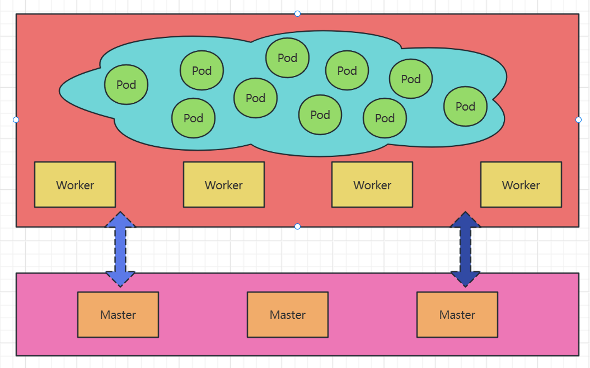
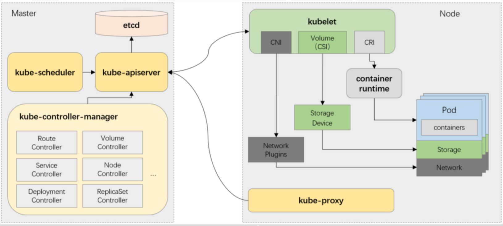

# kubernetes简介

## 1.kubernetes概念

> 1. kubernetes是一种开源容器管理工具，可自动执行容器部署，容器扩展，解决容器缩放和容器负载均衡（也成为容器编排管理工具）。由Golang编写。
> 2. kubernetes以集群的形式管理docker容器，除了容器的自动部署可缩放外，还通过自动重启策略启动失败的容器。

## 2.kubernetes集群的节点类型

- 由Master和Worker两类节点组成：
  1. Master：控制管理节点
  2. Worker：工作节点

- 运行逻辑
  1. Kubernetes将所有工作节点的资源集结在一起形成一台更加强大的服务器。
  2. 计算和存储接口通过Master之上的API Server暴露。
  3. 客户端通过API提交应用程序的运行请求，而后由Master通过调度算法将其自动指派至某特定的工作节点以 Pod对象的形式运行。
  4. Master会自动处理因工作节点的添加、故障或移除等变动对Pod的影响。

## 3.kubernetes集群架构

- kubernetes属于典型的Server-Client形式的二层架构
  1. Master主要由API-Server、Controller-Manager和Scheduler三个组件，以及一个用于集群状态存储的Etcd存储服务构成整个集群的控制平面。
  2. Worker节点主要包含kubelet、kube-proxy和容器运行时三个组件，承载运行各类应用容器。

### 3.1.Master Components

- API Server
  1. 整个集群的API网关，相关应用程序为kube-apiserver
  2. 基于http/https协议以REST风格提供，几乎所有功能全部抽象为“资源”及相关的“对象”
  3. 声明式API，用于只需要声明对象的“终态”，具体的业务逻辑由各资源相关的Controller负责完成
  4. 无状态，数据存储于etcd中
- Cluster Store
  1. 集群状态数据存储系统，通常指的就是etcd
  2. 仅会同API Server交互
- Controller Manager
  1. 负责实现客户端通过API提交的终态声明，相应应用程序为kube-controller-manager
  2. 由相关代码通过一系列步骤驱动API对象的“实际状态”接近或等同“期望状态”
- Scheduler
  1. 
  2. 调度器，负责为Pod挑选出（评估这一刻）最合适的运行节点
  3. 相关程序为kube-scheduler

### 3.2.Worker Components

- Kubelet
  1. Kubernetes集群于每个Worker节点上的代理，相应程序为kubelet
  2. 接收并执行Master发来的指令，管理由Scheduler绑定至当前节点上的Pod对象的容器
     - 通过API Server接收Pod资源定义，或从节点本地目录中加载静态Pod配置
     - 借助于兼容CRI的容器运行时管理和监控Pod相关的容器
- Kube Proxy
  1. 运行于每个Worker节点上，专用于负责将Service资源的定义转为节点本地的实现
  2. 接收并执行Master发来的指令，管理由Scheduler绑定至当前节点上的Pod对象的容器
     - 通过API Server接收Pod资源定义，或从节点本地目录中加载静态Pod配置
     - 借助于兼容CRI的容器运行时管理和监控Pod相关的容器
- Kube Proxy
  1. 运行于每个Worker节点上，专用于负责将Service资源的定义转为节点本地的实现
     - iptables模式：将Service资源的定义转为适配当前节点视角的iptables规则
     - ipvs模式：将Service资源的定义转为适配当前节点视角的ipvs和少量iptables规则
  2. 是打通Pod网络在Service网络的关键所在

### 3.3.Kubernetes Add-ons

- 负责扩展Kubernetes集群的功能的应用程序，通常以Pod形式托管运行于Kubernetes集群之上
- 必选插件
  1. Network Plugin：网络插件，经由CNI接口，负责为Pod提供专用的通信网络，有多种实现
     - CoreOS Flannel
     - ProjectCalico
  2. Cluster DNS：集群DNS服务器，负责服务注册、发现和名称解析，当下的实现是CoreDNS
- 重要插件
  1. Ingress Controller：Ingress控制器，负责为Ingress资源提供具体的实现，实现http/https协议的七层路由和流量调度，有多种实现，例如Ingress-Nginx、Contour等
  2. Metrics Server：Node和Pod等相关组件的核心指标数据收集器，它接受实时查询，但不存储指标数据
  3. Kubernetes Dashboard/Kuboard/Rainbond：基于Web的UI
  4. Prometheus：指标监控系统
  5. ELK/PLG：日集中式日志系统
  6. OpenELB：适用于非云端部署的Kubernetes环境的负载均衡器，可利用BGP和ECMP协议达到性能最优和高可用性

