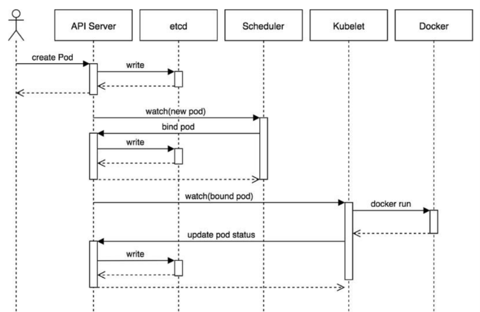
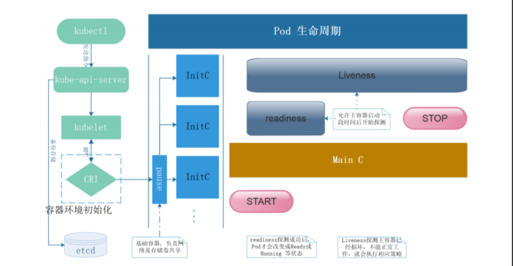

# Pod状态与探针

## 1.定义Pod

- 一个极简的Pod定义，仅需要为其指定一个要运行的容器即可，给出该容器的名称和使用的Image
- pause容器无需定义

~~~yaml
---
apiVersion: v1
kind: Pod
metadata:
  name: pod-demo
  namespace: default
spec:
  containers:
  - name: demo
    image: ikubernetes/demoapp:v1.0
~~~

## 2.Pod的调度与状态

### 2.1.Pod的调度流程

1. 提交Pod：用户通过 kubectl 命令或者通过 API 提交一个 创建Pod 的请求给 Kubernetes API 服务。
2. 存储 Pod 规格：API 服务接收到 Pod 定义后，生成一个包含创建信息资源清单文件，会将其存储在 etcd 中。etcd 是 Kubernetes 用于存储集群状态的分布式键值存储系统。
3. 调度器监视未分配节点的 Pod：Kube-scheduler 持续监视 API 服务，获取 podSpec.NodeName为空的Pod,即判断pod.spec.Node == null？若为null，表示这个Pod请求是新的，需要创建，调度器会挑选这些待调度的 Pod 进行处理。
4. 调度决策：Kube-scheduler 根据一系列调度策略和算法，决定将 Pod 调度到哪个节点上。
   - 过滤阶段（Filtering）：调度器会先过滤掉不符合要求的节点。这些要求可能包括节点是否有足够的资源（CPU、内存等），节点标签和Pod 标签是否匹配，以及节点上的污点和 Pod 的容忍度是否匹配。
   - 优选阶段（Scoring）：在过滤阶段之后，调度器会对剩余的节点进行评分，选择得分最高的节点。评分标准可能包括节点的资源利用率、节点的位置、Pod 的亲和性和反亲和性规则等。
5. 绑定 Pod 到节点：一旦调度器决定了最适合的节点，它会通过 API 服务器将 Pod 绑定到该节点。
6. Kubelet 接受 Pod：目标节点上的 kubelet 监视 API 服务器的变化。当发现新的 Pod 被调度到该节点时，kubelet 会接受该 Pod 并开始创建容器。
7. 创建容器：kubelet 使用容器运行时（例如 Docker 或 CRI-O）来拉取所需的镜像并启动容器。
8. Pod 运行：当所有容器都成功启动后，Pod 进入运行状态（Running）。

### 2.2.Pod的生命周期

1. 容器启动
   - Pod中的容器在创建前,有初始化容器(init container)来进行初始化环境，初化完后,主容器(main container)开始启动。
   - 主容器启动后，开始做健康检查
     - 存活状态检查(liveness probe )，用来检查主容器存活状态
     - 准备就绪检查(readiness probe)，用来检查主容器是否启动就绪
2. 容器重启策略
   - Always：表示容器挂了总是重启，默认策略，第一次容器挂了立即重启，如果再挂了就要延时10s重启，第三次挂了就等20s重启...... 依次类推
   - OnFailures：表示容器状态为错误时才重启，也就是容器正常终止时不重启
   - Never：表示容器挂了不予重启

### 2.3.Pod状态

1. Pending：Pod未能由Scheduler完成调度，通常由于资源依赖、资源不足和调度策略无法满足等原因导致
2. Init:N/M：Pod中定义了M个Init容器，其中N个已经运行完成，目前仍处于初始化过程中
3. Init:Error：Init容器运行失败，需借助日志排查具体的错误原因
4. Init:CrashLoopBackOff：Init容器启动失败，且在反复重启中，一般应该先确认配置方面的问题，再借助于日志进行排查
5. Completed：Pod中的各容器已经正常运行完毕，各容器进程业已经终止
6. CrashLoopBackOff：Pod启动失败，且处于反复重启过程中，通常是容器中的应用程序自身运行异常所致，可通过查看Pod事件、容器日志和Pod配置等几方面联合排查问题
7. ImagePullBackOff：Image拉取失败，检查Image URL是否正确，或手动测试拉取是否能够正常完成
8. Running：Pod运行正常；但也额外存在其内部进程未正常工作的可能性，此种情况下，可通过查看Pod事件、容器日志、Pod配置等几方面联合排查问题，或通过交互式测试验证问题所在
9. Terminating：Pod正处于关闭过程中，若超过终止宽限期仍未能正常退出，可使用命令强制删除该Pod命令：kubectl delete pod [$Pod] -n [$namespace] --grace-period=0 --force）
10. Evicted：Pod被节点驱逐，通常原因可能是由节点内存、磁盘空间、文件系统的inode、PID等资源耗尽所致，可通过Pod的status字段确定具体的原因所在，并采取有针对性的措施扩充相应的资源
11. Unschedulable：Pod不能被调度，kube-scheduler没有匹配到合适的node节点
12. Failed：Pod中有容器启动失败而导致pod工作异常
13. Unknown：由于某种原因无法获得pod的当前状态，通常是由于与pod所在的node节点通信错误
14. ..................................
