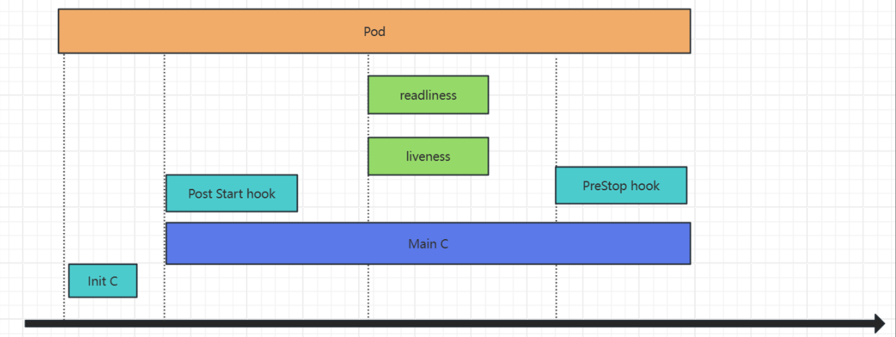

# Pod健康状态检测机制

## 1.init容器

1. 概念：
   - 在 Kubernetes 中，initContainers 是在应用容器（主容器）启动之前执行的容器。它们在 Pod 内部执行初始化任务，为主容器的启动做好准备。initContainers 提供了一种机制，确保某些任务在主容器运行之前完成，比如设置环境、下载依赖项或进行健康检查。
2. init容器的作用：
   - 可以为业务容器提前准备好业务容器的运行环境，比如将业务容器需要的配置文件提前生成并放在指定位置、检查数据权限或完整性、软件版本等基础运行环境。
   - 可以在运行业务容器之前准备好需要的业务数据，比如从OSS下载、或者从其它位置copy。
   - 检查依赖的服务是否能够访问。
3. init容器的特点：
   - 一个pod可以有多个业务容器还能在有多个init容器，但是每个init容器和业务容器的运行环境都是隔离的。每个 initContainer 有自己独立的文件系统和环境变量，不会直接共享主容器的文件系统。
   - init容器会比业务容器先启动，init容器运行成功之后才会继续运行业务容器。
   - 如果一个pod有多个init容器，则需要从上到下逐个运行并且全部成功，最后才会运行业务容器。
   - init容器不支持探针检测    (因为初始化完成后就退出再也不运行了)。

- 案例

~~~yaml
kind: Deployment
apiVersion: apps/v1
metadata:
  labels:
    app: myserver-myapp 
  name: myserver-myapp-deployment-name
  namespace: myserver
spec:
  replicas: 1 
  selector:
    matchLabels:
      app: myserver-myapp-frontend
  template:
    metadata:
      labels:
        app: myserver-myapp-frontend
    spec:
      containers:
        - name: myserver-myapp-container
          image: nginx:1.16.0
          imagePullPolicy: Always
          volumeMounts:
          - mountPath: "/usr/share/nginx/html/myserver"
            name: myserver-data
      initContainers:
        - name: init-web-data
          image: centos:7.9.2009
          command: ['/bin/bash','-c',"for i in `seq 1 10`;do echo '<h1>'$i web page at $(date +%Y%m%d%H%M%S) '<h1>' >> /data/nginx/html/myserver/index.html;sleep 1;done"]
          volumeMounts:
          - mountPath: "/data/nginx/html/myserver"
            name: myserver-data
        - name: change-data-owner
          image: busybox:1.28
          command: ['/bin/sh','-c',"/bin/chmod 644 /data/nginx/html/myserver/* -R"]
          volumeMounts:
          - mountPath: "/data/nginx/html/myserver"
            name: myserver-data
      volumes:
      - name: myserver-data
        hostPath:
          path: /tmp/data/html

---
kind: Service
apiVersion: v1
metadata:
  labels:
    app: myserver-myapp-service
  name: myserver-myapp-service-name
  namespace: myserver
spec:
  type: NodePort
  ports:
  - name: http
    port: 80
    targetPort: 80
    nodePort: 30081
  selector:
    app: myserver-myapp-frontend
~~~

## 2.Pod探针

### 2.1.Pod生命周期

- pod的生命周期，从start后可以配置postStart检测，运行过程中可以配置livenessProbe和readinessProbe,最后在 stop前可以配置preStop操作。

### 2.2.Pod健康检查

探针是由 kubelet 对容器执行的定期诊断，以保证Pod的状态始终处于运行状态，要执行诊断，kubelet 调用由容器实现的Handler(处理程序)，也成为Hook(钩子)，有三种类型的处理程序：

1. 监测类型
   - startup Probe：启动探针，判断容器内的应用程序是否已启动完成，如果配置了启动探测，则会先禁用所有其它的探测，直到startupProbe检测成功为止，如果startupProbe探测失败，则kubelet将杀死容器，容器将按照重启策略进行下一步操作，如果容器没有提供启动探测，则默认状态为成功
   - liveness Probe：存活探针，检测容器容器是否正在运行，如果存活探测失败，则kubelet会杀死容器，并且容器将受到其重启策略的影响，如果容器不提供存活探针，则默认状态为 Success，livenessProbe用于控制是否重启pod。
   - readiness Probe：就绪探针；如果就绪探测失败，端点控制器将从与Pod匹配的所有Service的端点中删除该Pod的IP地址，初始延迟之前的就绪状态默认为Failure(失败)，如果容器不提供就绪探针，则默认状态为 Success，readinessProbe用于控制pod是否添加至service。
2. 监测机制
   - Exec Action：在容器内执行指定命令，如果命令退出时返回码为0则认为诊断成功
   - TcpSocket Action：对指定端口上的容器的IP地址进行TCP检查，如果端口打开，则诊断被认为是成功的
   - HTTPGet Action：对指定的端口和路径上的容器的IP地址执行HTTPGet请求，如果响应的状态码大于等于200且小于 400，则诊断被认为是成功的
3. 通用配置参数
   - initialDelaySeconds：初始化延迟时间，告诉kubelet在执行第一次探测前应该等待多少秒，默认是0秒，最小值是0
   - periodSeconds：探测周期间隔时间，指定了kubelet应该每多少秒秒执行一次存活探测，默认是 10 秒。最小值是 1
   - timeoutSeconds：单次探测超时时间，探测的超时后等待多少秒，默认值是1秒，最小值是1。
   - successThreshold：从失败转为成功的重试次数，探测器在失败后，被视为成功的最小连续成功数，默认值是1，存活探测的这个值必须是1，最小值是 1。
   - failureThreshold：从成功转为失败的重试次数，当Pod启动了并且探测到失败，Kubernetes的重试次数，存活探测情况下的放弃就意味着重新启动容器，就绪探测情况下的放弃Pod 会被打上未就绪的标签，默认值是3，最小值是1。

- 案例

~~~yaml
apiVersion: apps/v1
kind: Deployment
metadata:
  name: myserver-myapp-frontend-deployment
  namespace: myserver
spec:
  replicas: 1
  selector:
    matchLabels: #rs or deployment
      app: myserver-myapp-frontend-label
    #matchExpressions:
    #  - {key: app, operator: In, values: [myserver-myapp-frontend,ng-rs-81]}
  template:
    metadata:
      labels:
        app: myserver-myapp-frontend-label
    spec:
      terminationGracePeriodSeconds: 60
      containers:
      - name: myserver-myapp-frontend-label
        image: nginx:1.20.2
        ports:
        - containerPort: 80
        
        ## 用于检测容器是否已成功启动。在启动探针成功之前，Pod 不会接收流量。path: /index.html（探测路径），port: 80（探测端口）
        startupProbe:
          httpGet:
            #path: /monitor/index.html
            path: /index.html
            port: 80
          initialDelaySeconds: 5 #首次检测延迟5s
          failureThreshold: 3  #从成功转为失败的次数
          periodSeconds: 3 #探测间隔周期
          
        ## 用于检测容器是否已准备好接收流量。如果就绪探针失败，Pod 会被从服务的负载均衡中移除。
        readinessProbe:
          httpGet:
            #path: /monitor/monitor.html
            path: /index.html
            port: 80
          initialDelaySeconds: 5
          periodSeconds: 3
          timeoutSeconds: 5
          successThreshold: 1
          failureThreshold: 3
        
        
        ## 用于检测容器是否处于健康状态。如果存活探针失败，容器将被重启。
        livenessProbe:
          httpGet:
            #path: /monitor/monitor.html
            path: /index.html
            port: 80
          initialDelaySeconds: 5
          periodSeconds: 3
          timeoutSeconds: 5
          successThreshold: 1
          failureThreshold: 3

---
apiVersion: v1
kind: Service
metadata:
  name: myserver-myapp-frontend-service
  namespace: myserver
spec:
  ports:
  - name: http
    port: 81
    targetPort: 80
    nodePort: 30012
    protocol: TCP
  type: NodePort
  selector:
    app: myserver-myapp-frontend-label
~~~

### 2.3.postStart 和 preStop 处理函数

1. postStart：Pod被创建后立即执行检测,即不等待pod中的服务启动。如果postStart执行失败pod不会继续创建。
2. preStop：在pod被停止之前执行

~~~yaml
apiVersion: apps/v1
kind: Deployment
metadata:
  name: myserver-myapp1-lifecycle
  labels:
    app: myserver-myapp1-lifecycle
  namespace: myserver
spec:
  replicas: 1
  selector:
    matchLabels:
      app: myserver-myapp1-lifecycle-label
  template:
    metadata:
      labels:
        app: myserver-myapp1-lifecycle-label
    spec:
      terminationGracePeriodSeconds: 60
      containers:
      - name: myserver-myapp1-lifecycle-label
        image: tomcat:7.0.94-alpine 
        lifecycle:
          postStart:
            exec:
             #command: 把自己注册到注册在中心
              command: ["/bin/sh", "-c", "echo 'Hello from the postStart handler' >> /usr/local/tomcat/webapps/ROOT/index.html"]

            #httpGet:
            #  #path: /monitor/monitor.html
            #  host: www.mmban.com
            #  port: 80
            #  scheme: HTTP
            #  path: index.html
          preStop:
            exec:
             #command: 把自己从注册中心移除
              command: ["/usr/local/tomcat/bin/catalina.sh","stop"]
        ports:
          - name: http
            containerPort: 8080

---
apiVersion: v1
kind: Service
metadata:
  name: myserver-myapp1-lifecycle-service
  namespace: myserver
spec:
  ports:
  - name: http
    port: 80
    targetPort: 8080
    nodePort: 30019
    protocol: TCP
  type: NodePort
  selector:
    app: myserver-myapp1-lifecycle-label
~~~

### 2.4.Pod重启策略

Pod一旦配置探针，在检测失败时候，会基于restartPolicy对Pod进行下一步操作

1. restartPolicy (容器重启策略)
   - Always：当容器异常时，k8s自动重启该容器，ReplicationController/Replicaset/Deployment，默认为Always。
   - OnFailure：当容器失败时(容器停止运行且退出码不为0)，k8s自动重启该容器。
   - Never：不论容器运行状态如何都不会重启该容器,Job或CronJob。默认Never。

### 2.5.Pod镜像拉取策略

imagePullPolicy (镜像拉取策略)

1. IfNotPresent：node节点没有此镜像就去指定的镜像仓库拉取，node有就使用node本地镜像
2. Always：每次重建pod都会重新拉取镜像
3. Never：从不到镜像中心拉取镜像，只使用本地镜像

### 2.6.Pod终止流程

1. 创建pod，完成调度流程，容器启动并执行postStart，livenessProbe，进入running状态，readinessProbe，service关联pod，接受客户端请求。
2. 删除pod，Pod被设置为”Terminating”状态、从service的Endpoints列表中删除并不再接受客户端请求。
3. 执行PreStop，Kubernetes向pod中的容器发送SIGTERM信号(正常终止信号)终止pod里面的主进程，这个信号让容器知道自己很快将会被关闭，terminationGracePeriodSeconds: 60  可选终止等待期，如果有设置删除宽限时间，则等待宽限时间到期，否则最多等待30s，Kubernetes等待指定的时间称为优雅终止宽限期,默认情况下是30秒,值得注意的是等待期与preStop Hook和SIGTERM信号并行执行，即Kubernetes可能不会等待preStop Hook完成(最长30秒之后主进程还没有结束就就强制终止pod)。SIGKILL信号被发送到Pod，并删除Pod。

