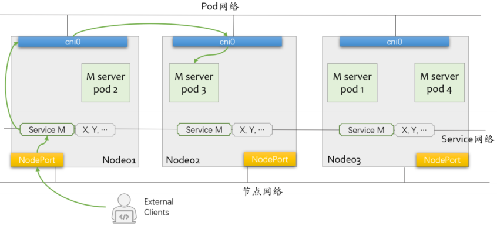
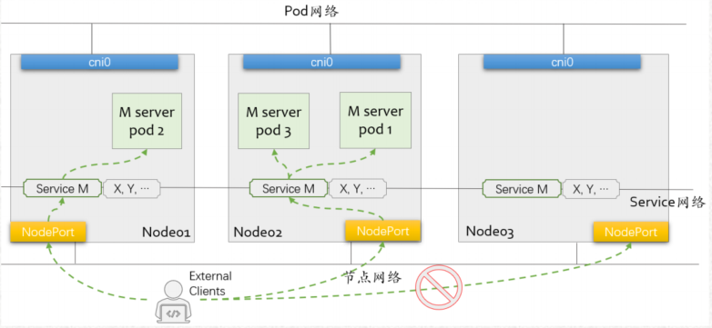
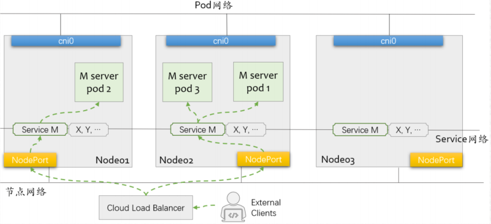

# Service及流量转发

## 1.创建Service资源

1. 负载均衡器入口：ClusterIP及相关的Service Port、NodePort（每个节点的Node IP都可用）
   - 根据通信需求，确定选择的类型
2. 标签选择器：用于筛选Pod，并基于筛选出的Pod的IP生成后端端点列表（被调度的上游端点）
3. Service类型的专有配置

## 2.标签和标签选择器

1. 标签：附加在资源对象上的键值型元数据
   - 键标识：由“键前缀（可选）”和“键名”组成，格式为“key_prefix/key_name”
     - 键前缀必须使用DNS域名格式
     - 键名的命名格式：支持字母、数字、连接号、下划线和点号，且只能以字母或数字开头；最长63个字符；
   - “kubectl label”命令可管理对象的标签
2. 标签选择器：基于标签筛选对象的过滤条件，支持两种类型
   - 基于等值关系的选择器
     - 操作符：=或==、!=
   - 基于集合关系的选择器
     - 操作符：in、notin和exists
     - 使用格式：KEY in (VALUE1, VALUE2, …)、 KEY notin (VALUE1, VALUE2, …)、KEY 和 !KEY

## 3.NodePort Service流量策略（1）

1. 流量策略一：Cluster，表示在整个Kubernetes集群范围内调度；
2. 该流量策略下，请求报文从某个节点上的NodePort进入，该节点上的Service会将其调度至任何一个可用后端Pod之上，而不关心Pod运行于哪个节点；

## 4.NodePort Service流量策略（2）

1. 流量策略二：Local，表示仅将请求调度至当前节点上运行的可用后端端点；
2. 该流量策略下，请求报文从某节点NodePort进入后，该节点上的Service仅会将请求调度至当前节点上适配到该Service的后端端点
3. 仅应该从运行有目标Service对象后端Pod对象的节点的NodePort发起访问

## 5.LoadBalancer类型的Service

1. 在接入外部流量方面，NodePort存在着几个方面的问题
2. 非知名端口、私网IP地址、节点故障转移、节点间负载均衡、识别能适配到某Service的Local流量策略的节点等
3. 外置的Cloud Load Balancer可以解决以上诸问题

