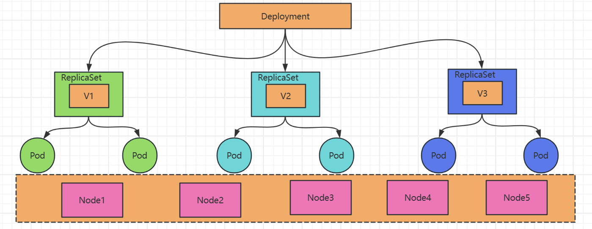
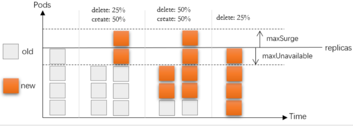

# Deployment控制器简介

## 1.Deployment概念

1. 负责编排无状态应用的基础控制器是ReplicaSet，相应的资源类型通过三个关键组件定义如何编排一个无状态应用
   - replicas：期望运行的Pod副本数
   - selector：标签选择器
   - podTemplate：Pod模板
2. Deployment是建立在ReplicaSet控制器上层的更高级的控制器
   - 借助于ReplicaSet完成无状态应用的基本编排任务
   - 它位于ReplicaSet更上面一层，基于ReplicaSet提供了滚动更新、回滚等更为强大的应用编排功能
   - 是ReplicaSet资源的编排工具
     - Deployment编排ReplicaSet
     - ReplicaSet编排Pod
3. 但是，应该直接定义Deployment资源来编排Pod应用，ReplicaSet无须显式给出

## 2.更新策略

1. Deployment控制器支持两种更新策略
   - 滚动式更新（rolling updates）
     - 逐批次更新Pod的方式，支持按百分比或具体的数量定义批次规模，默认策略
     - 触发条件：podTemplate的hash码变动
       - 仅podTemplate的配置变动才会导致hash码改变
       - replicas和selector的变更不会导致podTemplate的hash变动
   - 重建式更新（recreate）
     - 在Pod资源被删除时，使用新的模板定义被足缺失的Pod数量，完成更新
     - 触发条件：现有Pod被删除
2. 触发滚动更新
   - 最为常见的更新需求是应用升级，即镜像文件更新，常用方法
     - kubectl set image (-f FILENAME | TYPE NAME) CONTAINER_NAME_1=CONTAINER_IMAGE_1 ...
     -  kubectl patch (-f FILENAME | TYPE NAME) [-p PATCH|--patch-file FILE] [options]
   - 上面第二和第三种方法可用于模板中任何必要配置的更新
3. 查看更新
   - 更新状态：kubectl rollout status (TYPE NAME | TYPE/NAME) [flags] [options]
   - 更新历史：kubectl rollout history (TYPE NAME | TYPE/NAME) [flags] [options]
4. 回滚
   - 回滚到前一版本： kubectl rollout undo (TYPE NAME | TYPE/NAME) 
   - 回滚到指定版本： kubectl rollout undo (TYPE NAME | TYPE/NAME) --to-revision=X

## 3.配置滚动更新策略

1. Deployment的滚动更新支持使用如下两个字段来配置相关的策略
   - maxSurge：指定升级期间存在的总Pod对象数量最多可超出期望值的个数，其值可以是0或正整数，也可以是相对于期望值的一个百分比
   - maxUnavailable：升级期间正常可用的Pod副本数（包括新旧版本）最多不能低于期望值的个数，其值可以是0或正整数，也可以是相对于期望值的一个百分比，默认值为1
2. 存在的问题：必须以Pod为原子单位切割规模比例，且无法控制流量路由比例；

## 4.扩容和缩容

1. 容量管理类型
   - 横向伸缩：增加或减少Pod数量
   - 纵向（垂直）伸缩：调整Pod上的资源需求和资源限制
2. 变动Deployment资源对象中的replicas字段的值即会触发应用规模的扩容或缩容
   - 扩容和缩容是ReplicaSet的功能，具体操作由ReplicaSet完成
   - 根据应用规模的需要进行手动配置
3. 操作方法
   - patch命令
     - kubectl patch (-f FILENAME | TYPE NAME) [-p PATCH|--patch-file FILE] [options]
     - 例如：kubectl patch deployment deploy-example -p '{"spec":{"replicas":3}}'
4. 扩展：自动扩容和缩容
   - HPA（Horizontal Pod Autoscaler）控制器
   - VPA（Vertical Pod Autoscaler）控制器

