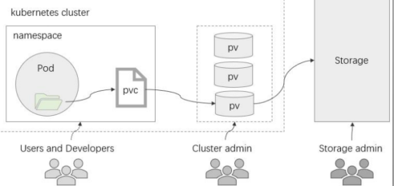

# 持久卷基础

## 1.PV和PVC

1. 在Pod级别定义存储卷有两个弊端
   - 卷对象的生命周期无法独立于Pod而存在
   - 用户必须要足够熟悉可用的存储及其详情才能在Pod上配置和使用卷
2. PV和PVC可用于降低这种耦合关系
   - PV（Persistent Volume）是集群级别的资源，负责将存储空间引入到集群中，通常由管理员定义
   - PVC（Persistent Volume Claim）是名称空间级别的资源，由用户定义，用于在空闲的PV中申请使用符合过滤条件的PV之一，与选定的PV是“一对一”的关系
   - 用户在Pod上通过pvc插件请求绑定使用定义好的PVC资源
3. StorageClass资源支持PV的动态预配（Provision）
4. PV资源
   - PV是标准的资源类型，除了负责关联至后端存储系统外，它通常还需要定义支持的存储特性
     - Volume Mode：当前PV卷提供的存储空间模型，分为块设备和文件系统两种
     - StorageClassName：当前PV隶属的存储类；
     - AccessMode：支持的访问模型，分为单路读写、多路读写和多路只读三种
     - Size：当前PV允许使用的空间上限
   - 在对象元数据上，还能够根据需要定义标签
   - 一般需要定义回收策略：Retain、Recycle和Delete
5. PVC资源
   - PVC也是标准的资源类型，它允许用户按需指定期望的存储特性，并以之为条件，按特定的条件顺序进行PV过滤
     - VolumeMode → LabelSelector → StorageClassName → AccessMode → Size
   - 支持动态预配的存储类，还可以根据PVC的条件按需完成PV创建

## 2.StorageClass

1. StorageClass资源
   - 为管理PV资源之便而按需创建的存储资源类别（逻辑组）
   - 为动态创建PV提供“模板”，需要存储服务提供管理API，StorageClass资源上配置接入API的各种参数
     - 定义在parameters字段中
     - 使用provisioner字段指明存储服务类型