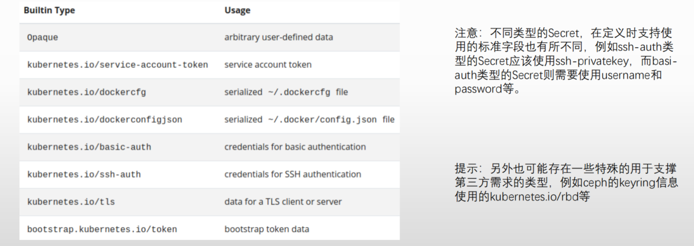

# ConfigMap和Secret基础

1. ConfigMap和Secret资源
   - ConfigMap和Secret是Kubernetes系统上两种特殊类型的存储卷
     - ConfigMap用于为容器中的应用提供配置数据以定制程序的行为，而敏感的配置信息，例如密钥、证书等则通常由Secret来配置
     - ConfigMap和Secret将相应的配置信息保存于资源对象中，而后在Pod对象上支持以存储卷的形式将其挂载并加载相关的配置，从而降低了配置与镜像文件的耦合关系，提高了镜像复用能力
     - Kubernetes借助于ConfigMap对象实现了将配置文件从容器镜像中解耦，从而增强了工作负载的可移植性，使其配置更易于更改和管理，并避免了将配置数据硬编码到Pod配置清单中
2. 都属于名称空间级别，只能被同一名称空间中的Pod引用
3. ConfigMap和Secret资源都是数据承载类的组件
   - 主要负责提供key-value格式的数据项，其值支持
     - 单行字符串：常用于保存环境变量值，或者命令行参数等
     - 多行字串：常用于保存配置文件的内容
   - 资源规范中不使用spec字段，而是直接使用特定的字段嵌套定义key-value数据
     - ConfigMap支持使用data或binaryData字段嵌套一至多个键值数据项
     - Secret支持使用data或stringData（非base64编码的明文格式）字段嵌套一至多个键值数据项

## 2.ConfigMap

### 2.1.创建ConfigMap对象

1. 创建ConfigMap对象的方法有两种
   - 命令式命令
     - 字面量：kubectl create configmap NAME --from-literal=key1=value1
     - 从文件加载：kubectl create configmap NAME --from-file=[key=]/PATH/TO/FILE
     - 从目录加载： kubectl create configmap NAME --from-file=[key=]/PATH/TO/DIR/
   - 配置文件
     - 命令式：kubectl create -f 
     - 声明式：kubectl apply -f
2. 引用ConfigMap对象
   - ConfigMap资源对象中以key-value保存的数据，在Pod中引用的方式通常有两种
     - 环境变量
       1. 引用ConfigMap对象上特定的key，以valueFrom赋值给Pod上指定的环境变量
       2. 在Pod上使用envFrom一次性导入ConfigMap对象上的所有key-value，key（也可以统一附加特定前缀）即为环境变量名，value自动成为相应的变量值
     - configMap卷
       1. 在Pod上将ConfigMap对象引用为存储卷，而后整体由容器mount至某个目录下。key转为文件名，value即为相应的文件内容
       2. 在Pod上定义configMap卷时，仅引用其中的部分key，而后由容器mount至目录下
       3. 在容器上仅mount configMap卷上指定的key

## 3.Secret

### 3.1.Secret资源

1. Secret主要用于存储密钥、OAuth令牌和 SSH 密钥等敏感信息，这些敏感信息采用base64编码保存，略好于明文存储
2. Secret根据其用途等，还有类型上的区分

### 3.2.创建Secret资源

1. 支持类似于ConfigMap的创建方式，但Secret有类型子命令，而且不同类型在data或stringData字段中支持嵌套使用的key亦会有所有同；
2. 命令式命令
   - generic
     - kubectl create secret generic NAME [--type=string] [--from-file=[key=]source] [--from-literal=key1=value1]
     - 除了后面docker-registry和tls命令之外的其它类型，都可以使用该命令中的--type选项进行定义，但有些类型有key的特定要求
   - tls
     - kubectl create secret tls NAME --cert=path/to/cert/file --key=path/to/key/file
     - 通常，其保存cert文件内容的key为tls.crt，而保存private key的key为tls.key
   - docker-registry
     - kubectl create secret docker-registry NAME --docker-username=user --docker-password=password --docker-email=email [--docker-server=string] [--from-file=[key=]source]
     - 从已有的json格式的文件加载生成的就是dockerconfigjson类型，命令行直接量生成的也是该类型
3. 引用Secret对象
   - 环境变量
     - 引用Secret对象上特定的key，以valueFrom赋值给Pod上指定的环境变量
     - 在Pod上使用envFrom一次性导入Secret对象上的所有key-value，key（也可以统一附加特定前缀）即为环境变量名，value自动成为相应的变量值
   - secret卷
     - 在Pod上将Secret对象引用为存储卷，而后整体由容器mount至某个目录下；key转为文件名，value即为相应的文件内容
     - 在Pod上定义Secret卷时，仅引用其中的部分key，而后由容器mount至目录下
     - 在容器上仅mount Secret卷上指定的key