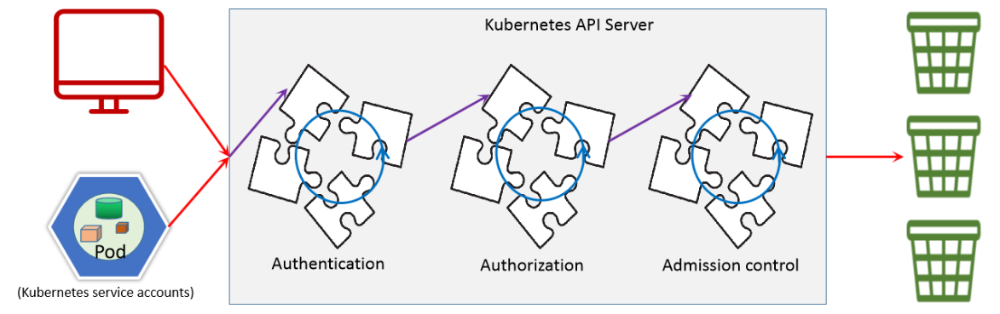
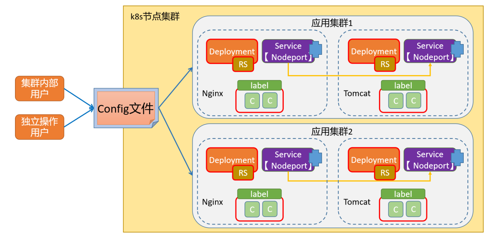

# 认证体系架构

## 1.API Server及其各客户端的通信模型

1. API Server是Kubernetes集群的网关，是能够与etcd通信惟一入口；
   - kube-controller-manager、kube-scheduler、kubelet、kube-proxy，以及后续部署的集群插件CoreDNS、Project Calico等，彼此间互不通信，彼此间的所有协作均经由API Server的REST API进行，它们都是API Server的客户端
   - 客户端对API Server的访问应经过身份验证及权限检查；
   - 为防止中间人攻击，各类客户端与API Server间的通信都应使用TLS进行加密
2. 各kubelet也会监听一些套接字，提供一个小型的REST API
   - 10250是具有所在节点上Pod管理权限的读写端口，应谨慎管理
   - 10255仅提供只读操作，是REST API的子集，10248是本地healthz端点使用的端口

## 2.API Server内置的访问控制机制

1. API Server内置了一个有着三级别的访问控制机制
   - 认证：核验请求者身份的合法性，对用户身份进行基本的认证，只允许被当前系统许可的人进入集群内部
   
   ~~~shell
   认证用户
   	在我们的认证范围中，有一个术语叫Subject，它表示我们在集群中基于某些规则和动作尝试操作的对象，在k8s集群中定义了两种类型的subject资源：
   	User Account：
   		有外部独立服务进行管理的，对于用户的管理集群内部没有一个关联的资源对象
   		如果需要操作k8s资源，需要集群内部证书的认证签名。
   	Service Account
   		通过Kubernetes API 来管理的一些用户帐号，和 namespace 进行关联的
   		一般是内部资源对象操作资源的一种方式
   		
   		
   用户组
   	单个控制用户的权限台繁琐，可以借助于用户组的机制实现批量用户的自动化管理，主要有以下几种
   	system:unauthenticated
   		未能通过任何一个授权插件检验的账号的所有未通过认证测试的用户统一隶属的用户组；	
   	system:authenticated
   		认证成功后的用户自动加入的一个专用组，用于快捷引用所有正常通过认证的用户账号；
   	system:serviceaccounts
   		所有名称空间中的所有ServiceAccount对象
   	system:serviceaccounts:<namespace>
   		特定名称空间内所有的ServiceAccount对象
   		
   		
   认证方式
   	kubernetes的认证方式主要有两种：
   		证书认证 - 本质上就是TLS双向认证
   		令牌认证 - 大量手动配置TLS认证比较麻烦，可以将证书生成token进行间接使用。
   ~~~
   
   - 授权：核验请求的操作是否获得许可，不同的用户可以获取不同的资源操作权限，比如普通用户、超级用户、等
   
   ~~~shell
   授权主要是在认证的基础上，用于对集群资源的访问控制权限设置，通过检查请求包含的相关属性值，与相对应的访问策略相比较，API请求必须满足某些策略才能被处理。常见授权机制有：
   Node
   	主要针对节点的基本通信授权认证，比如kubelet的正常通信。
   ABAC(Attribute Based Access Control)：
   	基于属性的访问控制，与apiserver服务的本地策略规则紧密相关，一旦变动需要重启。
   RBAC(Role Based Access Control)：
   	基于角色的访问控制，这是1.6+版本主推的授权策略，可以使用API自定义角色和集群角色，并将角色和特定的用户，用户组，Service Account关联起来，可以用来实现多租户隔离功能（基于namespace资源）
   ~~~
   
   - 准入控制：检查操作内容是否合规，似于审计，主要侧重于 操作动作的校验、语法规范的矫正等写操作场景。
   
   ~~~shell
   准入控制(Admission Control)，实际上是一个准入控制器插件列表，发送到APIServer的请求都需要经过这个列表中的每个准入控制器插件的检查，如果某一个控制器插件准入失败，就准入失败。它主要涉及到pod和容器对特定用户和特定权限之间的关联关系。比如操作的对象是否存在依赖关系、被操作的对象是否能够增删改查等限制。
   ~~~
   
2. 插件化机制，每种访问控制机制均有一组专用的插件栈
   - 认证：身份核验过程遵循“或”逻辑，且任何一个插件核验成功后都将不再进行后续的插件验证
     - 均不成功，则失败，或以“匿名者”身份访问
     - 建议禁用“匿名者”
   - 授权：鉴权过程遵循“或”逻辑，且任何一个插件对操作的许可授权后都将不再进行后续的插件验证
     - 均未许可，则拒绝请求的操作
   - 准入控制：内容合规性检查过程遵循“与”逻辑，且无论成败，每次的操作请求都要经由所有插件的检验
     - 将数据写入etcd前，负责检查内容的有效性，因此仅对“写”操作有效
     - 分两类：validating（校验）和 mutating（补全或订正）

## 3.API身份验证

### 3.1.Kubernetes上的用户

1. “用户”即服务请求者的身份指代，一般使用身份标识符进行识别
   - 用户标识：用户名或者ID
   - 用户组
2. Kubernetes系统的用户大体可分为 2 类
   - Service Account：服务账户，指Pod内的进程访问API Server时使用的身份信息
     - API Server使用ServiceAccount类型的资源对象来保存该类账号
     - 认证到API Server的认证信息称为Service Account Token，它们保存于同名的专用类型的Secret对象中
     - 名称空间级别
   - User Account：用户账户，指非Pod类的客户端访问API Server时使用的身份标识，一般是现实中的“人”
     - API Server没有为这类账户提供保存其信息的资源类型，相关的信息通常保存于外部的文件或认证系统中
     - 身份核验操作可由API Server进行，也可能是由外部身份认证服务完成
     - 本身非由Kubernetes管理，因而作用域为整个集群级别
3. 不能被识别为Service Account，也不能被识别为User Account的用户，即“匿名用户”

### 3.2.身份认证策略

1. X.509客户端证书认证
2. 持有者令牌（bearer token）
   - 静态令牌文件（Static Token File）
   - Bootstrap令牌
   - Service Account令牌
   - OIDC（OpenID Connect）令牌
   - Webhook令牌
3. 身份认证代理（Authenticating Proxy）
4. 匿名请求

### 3.3.API Server启用的身份认证机制

1. 基于认证插件支持多种认证方式，而相应认证插件的启用需要经由kube-apiserver上的专用选项完成
2. kubeadm v1.22 部署的集群默认启用的认证机制如右图红框中的选项，它们依次是
   - X509客户端证书认证
   - Bootstrap令牌认证
   - 身份认证代理
   - Service Account认证
3. API Server并不保证各认证插件的生效次序与定义的次序相同

### 3.4.kubelet启用的身份认证机制

1. kubelet的REST API端点默认通过TCP协议的10250端口提供，支持管理操作

   | Kubelet API | 功能简介                   |
   | ----------- | -------------------------- |
   | /pods       | 列出当前kubelet节点上的Pod |
   | /run        | 在一个容器内运行指定的命令 |
   | /exec       | 在一个容器内运行指定的命令 |
   | /configz    | 设置Kubelet的配置文件参数  |
   | /debug      | 调试信息                   |

2. 需要对客户端身份进行认证

   - 启用的身份认证
     - webhook
     - x509客户端证书认证
   - API Server是该API端点的客户端，因此，kubelet需要在验证客户端身份时信任给API Server颁发数字证书的CA

3. X.509数字证书认证

   - 在双向TLS通信中，客户端持有数字证书，而API Server信任客户端证书的颁发者
     - 信任的CA，需要在kube-apiserver程序启动时，通过--client-ca-file选项传递
   - 认证通过后，客户端数字证书中的CN（Common Name）即被识别为用户名，而O（Organization）被识别为组名
   - kubeadm部署的Kubernetes集群，默认使用 /etc/kubernetes/pki/ca.crt 进行客户端认证
     - /etc/kubernetes/pki/ca.crt是kubeadm为Kubernetes各组件间颁发数字证书的CA

4. 静态令牌文件

   - 令牌信息保存于文本文件中
   - 由kube-apiserver在启动时通过--token-auth-file选项加载
   - 加载完成后的文件变动，仅能通过重启程序进行重载，因此，相关的令牌会长期有效
   - 客户端在HTTP请求中，通过“Authorization Bearer TOKEN”标头附带令牌令牌以完成认证

5. Service Account令牌

   - 该认证方式将由kube-apiserver程序内置直接启用
   - 借助于经过签名的Bearer Token来验证请求
     - 签名时使用的密钥可以由--service-account-key-file选项指定，也可以默认使用API Server的tls私钥
   - 用于将Pod认证到API Server之上，以支持集群内的进程与API Server通信
     - Kubernetes可使用ServiceAccount准入控制器自动为Pod关联ServiceAccount

6. OpenID Connect（OIDC）令牌

   - OAuth2认证机制，通常由底层的IaaS服务所提供

7. Webhook令牌认证

   - 是一种用于验证Bearer Token的回调机制
   - 能够扩展支持外部的认证服务，例如LDAP等

8. 身份认证代理

   - 由kube-apiserver从请求报文的特定HTTP标头中识别用户身份，相应的标头名称可由特定的选项配置指定
   - kube-apiserver应该基于专用的CA来验证代理服务器身份

