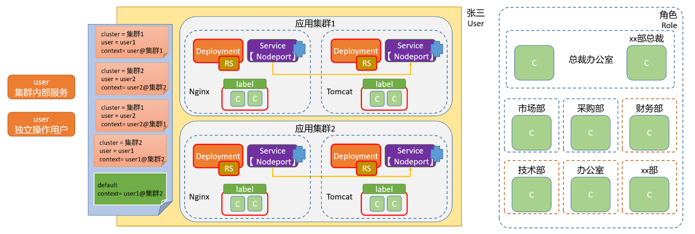

# 认证功能

## 1.X509 数字证书认证

1. X509客户端认证依赖于PKI证书体系，kubeadm部署Kubernetes集群时会自动生成所需要的证书，它们位于/etc/kubernetes/pki目录下。
2. 所有的证书
   - 各kubelet的证书可在Bootstrap过程中自动生成证书签署请求，而后由Kubernetes CA予以签署
   - 各kube-proxy、kube-scheduler和kube-controller-manager也都有相应的数字证书以完成向API Server的身份认证

### 1.2.用户认证（UA）

~~~shell
## 1.生成私钥
root@master01 /appoper # cd /etc/kubernetes/pki/
root@master01 /etc/kubernetes/pki # (umask 077; openssl genrsa -out kubecy.key 4096) 

genrsa			该子命令用于生成RSA私钥，不会生成公钥，因为公钥提取自私钥
-out filename	生成的私钥保存至filename文件，若未指定输出文件，则为标准输出
-numbits		指定私钥的长度，默认1024，该项必须为命令行的最后一项参数
~~~

~~~shell
## 2.创建证书签署请求, 用刚创建的私钥创建一个证书签名请求文件：kubecy.csr
root@master01 /etc/kubernetes/pki # openssl req -new -key  kubecy.key -out kubecy.csr -subj "/CN=kubecy/O=kubecy"

root@master01 /etc/kubernetes/pki # ls kubecy.*
kubecy.csr  kubecy.key

*.key 是我们的私钥，*.csr是我们的签名请求文件
-new  	生成证书请求文件
-key   	指定已有的秘钥文件生成签名请求，必须与-new配合使用
-out 	输出证书文件名称
-subj 	输入证书拥有者信息，这里指定 CN 以及 O 的值，/表示内容分隔
        CN以及O的值对于kubernetes很重要，因为kubernetes会从证书这两个值对应获取相关信息：
        "CN"：Common Name，用于从证书中提取该字段作为请求的用户名 (User Name)；浏览器使用该字段验证网站是否合法；
        "O"：Organization，用于分组认证
~~~

~~~shell
##3.由Kubernetes CA签署证书, 利用Kubernetes集群的CA相关证书对UA文件进行认证
root@master01 /etc/kubernetes/pki # openssl x509 -req -in kubecy.csr -CA ./ca.crt  -CAkey ./ca.key  -CAcreateserial -out kubecy.crt -days 365
-----------
Signature ok
subject=CN = kubecy, O = kubecy
Getting CA Private Key

root@master01 /etc/kubernetes/pki # ls kubecy.*
kubecy.crt  kubecy.csr  kubecy.key
-----------
*.crt就是我们最终生成的签证证书

-req   				产生证书签发申请命令
-in					指定需要签名的请求文件
-CA 				指定CA证书文件
-CAkey 			    指定CA证书的秘钥文件
-CAcreateserial	    生成唯一的证书序列号
-x509 				表示输出一个X509格式的证书
-days 				指定证书过期时间为365天
-out 				输出证书文件
~~~

~~~shell
## 4.验证
root@master01 /etc/kubernetes/pki #  openssl x509 -in kubecy.crt -text -noout
~~~

~~~shell
##5.将pki目录下的kubecy.crt、kubecy.key和ca.crt复制到某部署了kubectl的主机上，即可进行测试
root@master01 /etc/kubernetes/pki # scp -rp ./{kubecy.crt,kubecy.key} worker01:/etc/kubernetes/pki

##6.worker01
root@worker01 /etc/kubernetes/pki # ls
ca.crt  kubecy.crt  kubecy.key

##7.在worker01上发起访问测试
root@worker01 /etc/kubernetes/pki # kubectl get pods --client-certificate=./kubecy.crt --client-key=./kubecy.key --server=https://192.168.1.80:6443 --certificate-authority=/etc/kubernetes/pki/ca.crtt
~~~

## 2.集群用户

### 2.1.kubeconfig基础

1. kubeconfig是YAML格式的文件，用于存储身份认证信息，以便于客户端加载并认证到API Server
2. kubeconfig保存有认证到一至多个Kubernetes集群的相关配置信息，并允许管理员按需在各配置间灵活切换
   - clusters：Kubernetes集群访问端点（API Server）列表
   - users：认证到API Server的身份凭据列表
   - contexts：将每一个user同可认证到的cluster建立关联的上下文列表
   - current-context：当前默认使用的context
3. 客户端程序加载的kubeconfig文件的途径及次序
   - --kubeconfig选项
   - KUBECONFIG环境变量：其值是包含有kubeconfig文件的列表
   - 默认路径：$HOME/.kube/config

### 2.2.设定kubeconfig文件

1. 命令：kubectl config SUBCOMMAND [options]
   - 打印加载的kubeconfig
     - view
   - cluster相关的子命令
     - get-clusters
     - set-cluster
     - delete-cluster
   - user相关的子命令
     - get-users
     - set-credentials
     - delete-user
   - context相关的子命令
     - get-contexts
     - set-context
     - delete-context
     - rename-context
   - current-context相关的子命令
     - current-context
     - use-context
2. 基于X509客户端证书认证的kubecy用户添加至kubeusers.conf文件中，同一个列表下，不同项的名称不能相同

~~~shell
## 1.创建用户
kubectl config set-credentials kubecy --client-certificate=./kubecy.crt --client-key=./kubecy.key  --embed-certs=true --kubeconfig=/tmp/kubecy.conf

参数详解：
    set-credentials 	                        子命令的作用就是给kubeconfig认证文件创建一个用户条目
    --client-certificate=path/to/certfile	    指定用户的签证证书文件
    --client-key=path/to/keyfile				指定用户的私钥文件
    --embed-certs=true                          在kubeconfig中为用户条目嵌入客户端证书/密钥，默认值是false，
    --kubeconfig=/path/to/other_config.file     表示将属性信息单独输出到一个文件，不指定的话，表示存到默认的~/.kube/config文件中
    
  
## 2.创建集群
root@master01 /etc/kubernetes/pki # kubectl config set-cluster kubernetes-repl  --server="https://192.168.1.80:6443" --certificate-authority=/etc/kubernetes/pki/ca.crt --embed-certs=true --kubeconfig=/tmp/kubecy.conf

参数详解：
	--server=cluster_api_server
	--certificate-authority=path/to/certificate/authority
	
	
## 3.关联用户和集群
root@master01 /etc/kubernetes/pki # kubectl  config set-context kubecy@kubernetes-repl --cluster=kubernetes-repl --user=kubecy  --kubeconfig=/tmp/kubecy.conf

属性详解
    --cluster=cluster_nickname		关联的集群名称
    --user=user_nickname			关联的用户名称
    --namespace=namespace			可以设置该生效的命名空间
    
    
## 4.设定默认的入口, 更改默认登录kubernetes的用户
root@master01 /etc/kubernetes/pki # kubectl config use-context kubecy@kubernetes-repl --kubeconfig=/tmp/kubecy.conf

## 5.验证
root@master01 /etc/kubernetes/pki # kubectl config view --kubeconfig=/tmp/kubecy.conf
apiVersion: v1
clusters:
- cluster:
    certificate-authority-data: DATA+OMITTED
    server: https://192.168.1.200:6443
  name: kubernetes-repl
contexts:
- context:
    cluster: kubernetes-repl
    user: kubecy
  name: kubecy@kubernetes-repl
current-context: kubecy@kubernetes-repl
kind: Config
preferences: {}
users:
- name: kubecy
  user:
    client-certificate-data: DATA+OMITTED
    client-key-data: DATA+OMITTED
    
    
## 6.查看资源测试
root@master01 /etc/kubernetes/pki # kubectl get pod --kubeconfig=/tmp/kubecy.conf
Error from server (Forbidden): pods is forbidden: User "kubecy" cannot list resource "pods" in API group "" in the namespace "default"

-------
虽然提示报错，但是这也证明了用户已经被kubernetes承认了。
~~~

## 3.Service Account（SA）

### 3.1.Service Account基础

1. 为何需要Service Account？
   - Kubernetes原生（kubernetes-native）托管运行于Kubernetes之上，通常需要直接与API Server进行交互以获取必要的信息
   - API Server同样需要对这类来自于Pod资源中客户端程序进行身份验证，Service Account也就是设计专用于这类场景的账号
2. 在Pod上使用Service Account
   - 自动设定：Service Account通常由API Server自动创建并通过 ServiceAccount准入控制器自动关联到集群中创建的每个Pod上
   - 自定义：在Pod规范上，使用serviceAccountName指定要使用的特定ServiceAccount

### 3.2.ServiceAccount资源

1. ServiceAccount是Kubernetes API上的标准资源类型
   - 基于**资源对象**保存ServiceAccount的数据
   - 认证信息保存于ServiceAccount对象专用的Secret中（v1.23及之前的版本）
   - 隶属名称空间级别，专供集群上的Pod中的进程访问API Server时使用
2. Kubernetes基于三个组件完成Pod上serviceaccount的自动化
   - ServiceAccount Admission Controller：负责完成Pod上的ServiceAccount的自动化
     - 为每个名称空间生成一个默认的default ServiceAccount及其依赖到的Secret对象（如果用得到）
     - 为未定义serviceAccountName的Pod资源自动附加名称空间下的serviceaccounts/default；
     - 为定义了serviceAccountName的Pod资源检查其引用的目标对象是否存在
   - Token Controller
   - ServiceAccount Controller
3. 需要用到特殊权限时，可为Pod指定要使用的自定义ServiceAccount资源对象

### 3.3.ServiceAccount的Secret和Token

1. ServiceAccount使用专用的Secret对象（Kubernetes v1.23-）存储相关的敏感信息
   - Secret对象的类型标识为“kubernetes.io/serviceaccount”
   - 该Secret对象会自动附带认证到API Server用到的Token，也称为ServiceAccount Token
2. ServiceAccount Token的不同实现方式
   - Kubernetes v1.20-
     - 系统自动生成专用的Secret对象，并基于**secret卷插件**关联至相关的Pod；
     - Secret中会自动附带Token，且永久有效；
   - Kubernetes v1.21-v1.23
     - 系统自动生成专用的Secret对象，并通过**projected卷插件**关联至相关的Pod；
     - Pod不会使用Secret上的Token，而是由Kubelet向TokenRequest API请求生成，默认有效期为一年，且每小时更新一次；
   - Kubernetes v1.24+
     - 系统不再自动生成专用的Secret对象
     - 由Kubelet负责向TokenRequest API请求生成Token

### 3.4.ServiceAccount中的数据

1. ServiceAccount专用的Secret对象有三个固定的数据项，它们的键名称分别为
   - ca.crt：Kubernetes CA的数字证书
   - namespace：该ServiceAccount可适用的名称空间
   - token：认证到API Server的令牌，其生成方式曾多次变动
2. Kubernetes v1.21及之后的版本中，Pod加载上面三种数据的方式，改变为基于projected卷插件，通过三个数据源（source）分别进行
   - serviceAccountToken：提供由Kubelet负责向TokenRequest API请求生成的Token
   - configMap：经由kube-root-ca.crt这个ConfigMap对象的ca.crt键，引用Kubernetes CA的证书
   - downwardAPI：基于fieldRef，获取当前Pod所处的名称空间
3. 特殊场景
   - 若需要一个永不过期的Token，可手动创建ServiceAccount专用类型的Secret，并将其关联到ServiceAccount之上

### 3.5.创建和使用ServiceAccount

1. 命令：kubectl create serviceaccount NAME [--dry-run=server|client|none] 
2. 资源配置：

~~~yaml
apiVersion: v1  						# ServiceAccount所属的API群组及版本
kind: ServiceAccount  					# 资源类型标识
metadata:
  name <string>  						# 资源名称
  namespace <string>  					# ServiceAccount是名称空间级别的资源
automountServiceAccountToken <boolean>  # 是否让Pod自动挂载API令牌
secrets <[]Object>   					# 以该SA运行的Pod所要使用的Secret对象组成的列表
  apiVersion <string>  					# 引用的Secret对象所属的API群组及版本，可省略
  kind <string>   						# 引用的资源的类型，这里是指Secret，可省略
  name <string>   						# 引用的Secret对象的名称，通常仅给出该字段即可
  namespace <string>  					# 引用的Secret对象所属的名称空间
  uid  <string>   						# 引用的Secret对象的标识符；
imagePullSecrets <[]Object> 			# 引用的用于下载Pod中容器镜像的Secret对象列表
  name <string>   						# docker-registry类型的Secret资源的名称
~~~

- Pod上引用ServiceAccount对象，仅支持引用同一名称空间下的对象

~~~yaml
apiVersion: v1
kind: ServiceAccount
metadata:
  name: kubecy
---
apiVersion: v1
kind: Pod
metadata:
  name: nginx-web
spec:
  containers:
  - name: nginx-web
    image: kubernetes-register.kubecy.com/kubecy/nginx_web:v0.1
  serviceAccountName: kubecy   ## SA名字
~~~

