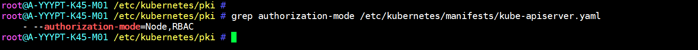
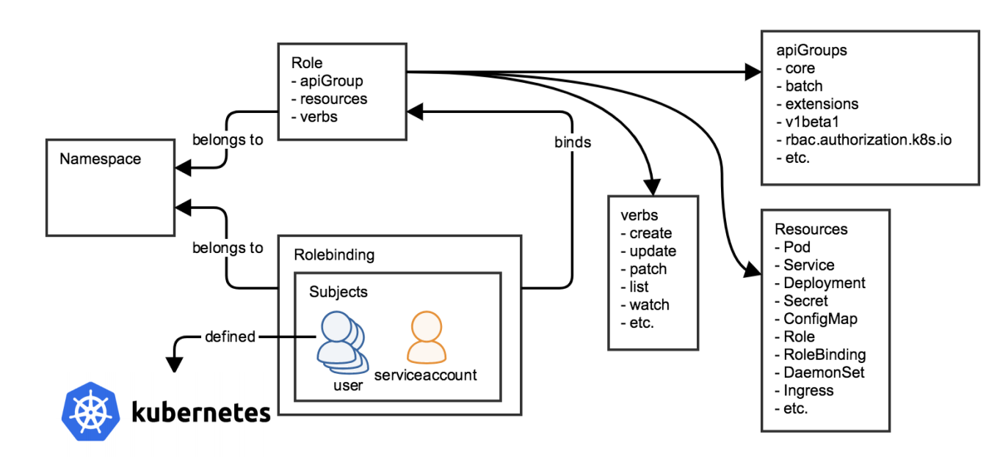
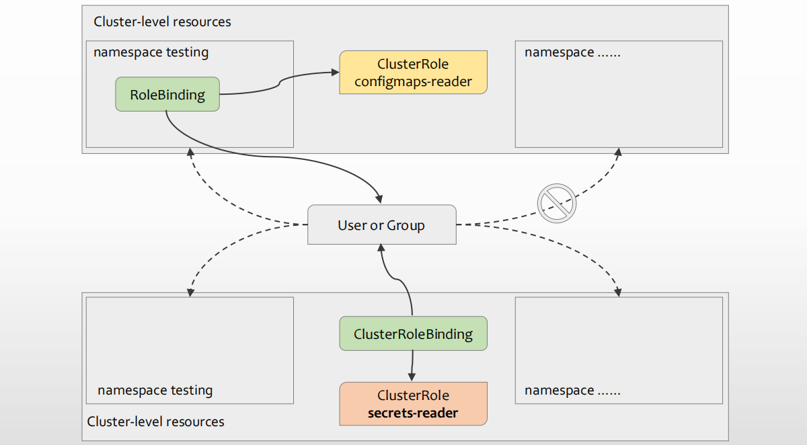

# 鉴权体系与RBAC

## 1.Kubernetes鉴权体系

1. API Server中的鉴权框架及启用的鉴权模块负责鉴权
   1. Node：专用的授权模块，它基于kubelet将要运行的Pod向kubelet进行授权；
   2. ABAC：通过将属性（包括资源属性、用户属性、对象和环境属性等）组合 在一起的策略，将访问权限授予用户
   3. RBAC：基于企业内个人用户的角色来管理对计算机或网络资源的访问的鉴权方法；
   4. Webhook：用于支持同Kubernetes外部的授权机制进行集成；
   5. 另外两个特殊的鉴权模块是AlwaysDeny和AlwaysAllow
2. 配置方法
   - 在kube-apiserver上使用 --authorization-mode 选项进行定义，kubeadm部署的集群，默认启用了Node和RBAC；多个模块彼此间以逗号分隔

## 2.RBAC鉴权模型

### 2.1.RBAC基础概念

1. 实体（Entity）：在RBAC也称为Subject，通常指的是User、Group或者是ServiceAccount
2. 角色（Role）：承载资源操作权限的容器
3. 资源（Resource）：在RBAC中也称为Object，指代Subject期望操作的目标，例如Secret、Pod及Service对象等
   - 仅限于/api/v1/…及`/apis/<group>/<version>/`…起始的路径
   - 其它路径对应的端点均被视作“非资源类请求（Non-Resource Requests）”，例如/api或/healthz等端点
4. 动作（Actions）：Subject可以于Object上执行的特定操作，具体的可用动作取决于Kubernetes的定义
   - 资源型对象
     - 只读操作：get、list、watch等
     - 读写操作：create、update、patch、delete、deletecollection等
   - 非资源型端点仅支持get操作
5. 角色绑定（Role Binding）：将角色关联至实体上，它能够将角色具体的操作权限赋予给实体
6. 角色的类型
   - Cluster级别：称为ClusterRole，定义集群范围内的资源操作权限集合，包括集群级别及名称空间级别的资源对象
   - Namespace级别：称为Role，定义名称空间范围内的资源操作权限集合
7. 角色绑定的类型
   - Cluster级别：称为ClusterRoleBinding，可以将实体（User、Group或ServiceAccount）关联至ClusterRole
   - Namespace级别：称为RoleBinding，可以将实体关联至ClusterRole或Role
     - 即便将Subject使用RoleBinding关联到了ClusterRole上，该角色赋予到Subject的权限也会降级到RoleBinding所属的Namespace范围之内

### 2.2.RBAC的基本工作逻辑

1. Namespace、Subject、Role和RoleBinding之间的关系

### 2.3.RoleBinding and ClusterRoleBinding

1. 启用RBAC鉴权模块时，API Server会自动创建一组ClusterRole和ClusterRoleBinding对象
   - 多数都以“system:”为前缀，也有几个面向用户的ClusterRole未使用该前缀，如cluster-admin、admin等
   - 默认使用“kubernetes.io/bootstrapping: rbac-defaults”这一标签
2. 默认的ClusterRole大体可以分为如下5个类别
   - API发现相关的角色
     - 包括system:basic-user、system:discovery和system:public-info-viewer
   - 面向用户的角色
     - 包括cluster-admin、admin、edit和view
   - 核心组件专用的角色
     - 包括system:kube-scheduler、system:volume-scheduler、system:kube-controller-manager、system:node和system:node-proxier等
   - 其它组件专用的角色
     - 包括system:kube-dns、system:node-bootstrapper、system:node-problem-detector和system:monitoring等
   - 内置控制器专用的角色

### 2.4.面向用户的角色

| 默认的ClusterRole | 默认的ClusterRoleBinding | 描述                                                         |
| ----------------- | ------------------------ | ------------------------------------------------------------ |
| cluster-admin     | system:masters 组        | 允许用户在目标范围内的任意资源上执行任意操作；使用ClusterRoleBinding关联至用户时，授权操作集群及所有名称空间中任何资源；使用RoleBinding关联至用户时，授权控制其所属名称空间中的所有资源，包括Namespace资源自身 |
| admin             |                          | 管理员权限，主要用于结合RoleBinding为特定名称空间快速授权生成管理员用户，它能够将RoleBinding所属名称空间中的大多数资源的读/写权限授予目标用户，包括创建Role和RoleBinding的能力；但不支持对ResourceQuota及Namespace本身进行操作 |
| edit              |                          | 接近于admin的权限，支持对名称空间内的大多数对象进行读/写操作，包括Secret，但不允许查看或修改Role及RoleBinding |
| view              |                          | 允许以只读方式访问名称空间中的大多数对象，但不包括Role、RoleBinding和Secret； |

## 3.使用RBAC鉴权机制

### 3.1.Role

1. 命令式命令
   - kubectl create role NAME --verb=verb --resource=resource.group/subresource [--resource-name=resourcename]
     - verb：允许在资源上使用的操作（verb）列表
     - resources.group/subresource：操作可施加的目标资源类型或子资源列表
     - resourcename：特定的资源对象列表，可选
2. 生成的资源对象的资源配置

~~~yaml
apiVersion: rbac.authorization.k8s.io/v1
kind: Role
metadata:
  name: pods-viewer
  namespace: default
rules:
- apiGroups:
  - ""
  resources:
  - pods
  verbs:
  - get
  - list
  - watch
~~~

### 3.2.RoleBinding

1. 命令式命令
   - kubectl create rolebinding NAME --clusterrole=NAME|--role=NAME [--user=username] [--group=groupname] [--serviceaccount=namespace:serviceaccountname]
     - 可以绑定到Role，也可以绑定到ClusterRole，后者会将ClusterRole的权限缩减至当前名称空间之内
     - Subject可以是User、Group或者ServiceAccount
   - 示例：将用户tom绑定至角色pods-viewer之上
     - 命令：kubectl create rolebinding tom-attachto-pods-viewer --role=pods-viewer --user=tom --namespace=default
     - tom用户是否可读取default名称空间内的pods资源，以及其它资源
   - 引用ClusterRole
     - kubectl create rolebinding jerry-attachto-cluster-admin --clusterrole=cluster-admin --user=jerry --namespace=test
2. 资源配置

~~~yaml
apiVersion: rbac.authorization.k8s.io/v1
kind: RoleBinding
metadata:
  name: tom-attachto-pods-viewer
  namespace: default
roleRef:
  apiGroup: rbac.authorization.k8s.io
  kind: Role
  name: pods-viewer
subjects:
- apiGroup: rbac.authorization.k8s.io
  kind: User
  name: tom
~~~

### 3.3.ClusterRole和ClusterRoleBinding

1. 命令式命令
   - ClusterRole：kubectl create clusterrole NAME --verb=verb --resource=resource.group [--resource-name=resourcename]
   - ClusterRoleBinding：kubectl create clusterrolebinding NAME --clusterrole=NAME [--user=username] [--group=groupname] [--serviceaccount=namespace:serviceaccountname]
   - 示例：
     - kubectl create clusterrolebinding mason --clusterrole=view --group=developers
2. 资源规范
   - ClusterRole的资源规范同Role相似
   - ClusterRoleBidning的资源规范跟RoleBinding相似
