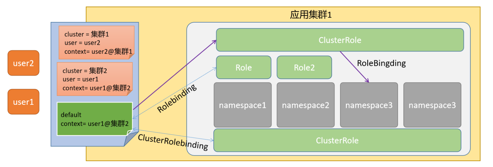

# 授权

## 1.授权级别

1. 授权其实指的是，将某些subject对象赋予执行某些资源动作的权限。我们有时候会将其称为Group(权限组)，而这个组其实是有两部分组成：组名和组关联(也称绑定)。
2. 关于kubernetes的授权属性，主要包括如下三个层次：namespace级别、cluster级别、混合级别

## 2.属性解析

~~~yaml
apiVersion: rbac.authorization.k8s.io/v1
kind: Role
metadata:
  creationTimestamp: null		时间信息
  name: pods-reader				role的名称
rules:							授权规则
- apiGroups:					操作的对象
  - ""								所有权限
  resources:					资源对象
  - pods							pod的对象
  verbs:						对pod允许的权限
  - get								获取
  - list							查看

    对于一个role必备的rules来说，他主要有三部分组成：apiGroup、resources、verbs
    apiGroups	设定包含资源的api组，如果是多个，表示只要属于api组范围中的任意资源都可以操作
    resources	位于apiGroup范围中的某些具体的资源对象
    verbs		针对具体资源对象的一些具体操作
~~~

### 2.1.案例

~~~yaml
## 1.初始化实例对象
root@master01 /root # cat kubernetes_secure_role.yaml                                                                       
apiVersion: rbac.authorization.k8s.io/v1
kind: Role
metadata:
  name: myrole
rules:
- apiGroups: ["", "extensions", "apps"]
  resources: ["pods", "deployments", "replicasets"]
  verbs: ["get", "list", "watch", "create", "update", "patch", "delete"]
  
  
  
属性解析：
    Pod属于 core 的 API Group，在YAML中用空字符就可以，Deployment 属于 apps 的 API Group，ReplicaSets属于extensions这个 API Group，所以 rules 下面的 apiGroups 的内容：["", "extensions", "apps"]
    verbs是可以对这些资源对象执行的操作，如果是所有动作，也可以使用["*"]来代替。
    
    
## 2.限定用户只能访问命名空间资源
root@master01 /root # kubectl create rolebinding super-rolebind --role=myrole --user=kubecy
~~~

### 2.2.查看

~~~shell
root@master01 /root # kubectl  get pod --kubeconfig=/tmp/kubecy.conf
NAME                                      READY   STATUS    RESTARTS      AGE
nfs-client-provisioner-58dcc897b4-f57pv   1/1     Running   2 (19h ago)   47h
web-0                                     1/1     Running   0             47h
web-1                                     1/1     Running   0             47h

root@master01 /root # kubectl  get svc --kubeconfig=/tmp/kubecy.conf
Error from server (Forbidden): services is forbidden: User "kubecy" cannot list resource "services" in API group "" in the namespace "default"
~~~

### 2.3.清理授权

~~~yaml
root@master01 /root # kubectl delete rolebindings super-rolebind
~~~

## 3.综合案例

### 3.1.Prometheus的权限需求

~~~yaml
---  
apiVersion: rbac.authorization.k8s.io/v1
kind: ClusterRole
metadata:
  name: prometheus
rules:
- apiGroups: [""]
  resources:
  - nodes
  - nodes/proxy
  - services
  - endpoints
  - pods
  verbs:
  - get
  - list
  - watch
- apiGroups:
  - extensions
  resources:
  - ingresses
  verbs:
  - get
  - list
  - watch
- nonResourceURLs: ["/metrics"]
  verbs:
  - get

---
apiVersion: v1
kind: ServiceAccount
metadata:
  name: prometheus
  namespace: prom

---
apiVersion: rbac.authorization.k8s.io/v1
kind: ClusterRoleBinding
metadata:
  name: prometheus
roleRef:
  apiGroup: rbac.authorization.k8s.io
  kind: ClusterRole
  name: prometheus
subjects:
- kind: ServiceAccount
  name: prometheus
  namespace: prom
~~~

### 3.2.Jenkins的权限需求

~~~yaml
apiVersion: rbac.authorization.k8s.io/v1
kind: ClusterRole
metadata:
  name: jenkins-master
rules:
- apiGroups: [""]
  resources: ["pods"]
  verbs: ["create", "delete", "get", "list", "patch", "update", "watch"]
- apiGroups: [""]
  resources: ["pods/exec"]
  verbs: ["create", "delete", "get", "list", "patch", "update", "watch"]
- apiGroups: [""]
  resources: ["pods/log"]
  verbs: ["get", "list", "watch"]
- apiGroups: [""]
  resources: ["events"]
  verbs: ["watch"]
- apiGroups: [""]
  resources: ["secrets"]
  verbs: ["get"]

---
apiVersion: v1
kind: ServiceAccount
metadata:
  name: jenkins-master
  namespace: jenkins

---
apiVersion: rbac.authorization.k8s.io/v1
kind: ClusterRoleBinding
metadata:
  name: jenkins-master
roleRef:
  kind: ClusterRole
  name: jenkins-master
  apiGroup: rbac.authorization.k8s.io
subjects:
- kind: ServiceAccount
  name: jenkins-master
  namespace: jenkins
~~~

