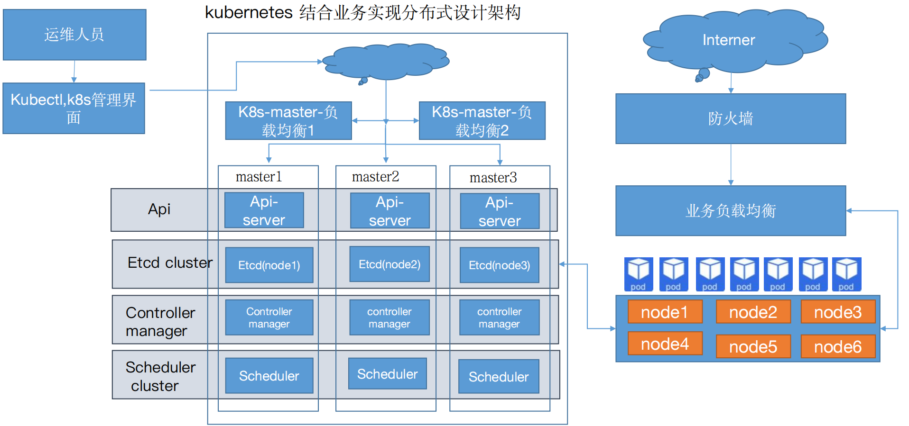
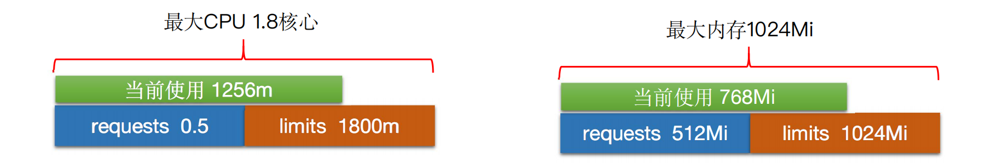
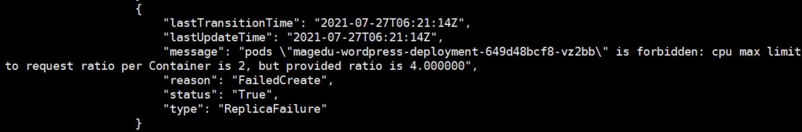
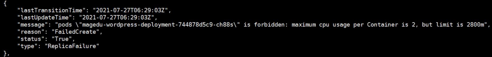

# kubernetes资源限制

## 1.资源限制概括

1. 

1. 如果运行的容器没有定义资源(memory、CPU)等限制，但是在namespace定义了LimitRange限制，那么该容器会继承LimitRange中的默认限制。
2. 如果namespace没有定义LimitRange限制，那么该容器可以只要宿主机的最大可用资源，直到无资源可用而触发宿主机(OMM)
3. requests(请求)为kubernetes scheduler执行pod调度时node节点至少需要拥有的资源。
4. limits(限制)为pod运行成功后最多可以使用的资源上限。

>:mag:https://kubernetes.io/zh/docs/tasks/configure-pod-container/assign-cpu-resource/
>
>CPU 以核心为单位进行限制，单位可以是整核、浮点核心数或毫核(m/milli)：2=2核心=200% 0.5=500m=50% 1.2=1200m=120%

>:mag:https://kubernetes.io/zh/docs/tasks/configure-pod-container/assign-memory-resource/
>
>memory 以字节为单位,单位可以是E、P、T、G、M、K、Ei、Pi、Ti、Gi、Mi、Ki
>
>1536Mi=1.5Gi

## 2.为单个容器限制

1. pod.containers.resources定义包含两部分：requests和limits
2. requests，指明pod运行需要的最少计算资源。调度器查找具有充足计算资源的nodes。
3. limits，指明pod运行可以获得节点最多计算资源，用于阻止pod占用node太多计算资源。node使用Linux内核功能cgroup，限制pod资源使用。

~~~yaml
#apiVersion: extensions/v1beta1
apiVersion: apps/v1
kind: Deployment
metadata:
  name: limit-test-deployment
  namespace: magedu
spec:
  replicas: 1
  selector:
    matchLabels: #rs or deployment
      app: limit-test-pod
#    matchExpressions:
#      - {key: app, operator: In, values: [ng-deploy-80,ng-rs-81]}
  template:
    metadata:
      labels:
        app: limit-test-pod
    spec:
      containers:
      - name: limit-test-container
        image: lorel/docker-stress-ng
        resources:
          limits:
            cpu: "1.3"
            memory: "512Mi"
          requests:
            memory: "100Mi"
            cpu: "500m"
        #command: ["stress"]
        args: ["--vm", "2", "--vm-bytes", "256M"]
      #nodeSelector:
      #  env: group1
~~~

## 3.为单个Pod限制

1. 设置 Pod 的资源限制通常与为容器设置资源限制是同步进行的，因为 Pod 是由容器组成的

~~~yaml
kind: Deployment
apiVersion: apps/v1
metadata:
  labels:
    app: mmban-wordpress-deployment-label
  name: mmban-wordpress-deployment
  namespace: mmban
spec:
  replicas: 1
  selector:
    matchLabels:
      app: mmban-wordpress-selector
  template:
    metadata:
      labels:
        app: mmban-wordpress-selector
    spec:
      containers:
      - name: mmban-wordpress-nginx-container
        image: nginx:1.16.1
        imagePullPolicy: Always
        ports:
        - containerPort: 80
          protocol: TCP
          name: http
        env:
        - name: "password"
          value: "123456"
        - name: "age"
          value: "18"
        resources:
          limits:
            cpu: 1
            memory: 1Gi
          requests:
            cpu: 500m
            memory: 512Mi

      - name: mmban-wordpress-php-container
        image: php:5.6-fpm-alpine 
        imagePullPolicy: Always
        ports:
        - containerPort: 80
          protocol: TCP
          name: http
        env:
        - name: "password"
          value: "123456"
        - name: "age"
          value: "18"
        resources:
          limits:
            #cpu: 2.8
            cpu: 2
            memory: 1Gi
          requests:
            cpu: 1.5
            memory: 512Mi

---
kind: Service
apiVersion: v1
metadata:
  labels:
    app: mmban-wordpress-service-label
  name: mmban-wordpress-service
  namespace: mmban
spec:
  type: NodePort
  ports:
  - name: http
    port: 80
    protocol: TCP
    targetPort: 8080
    nodePort: 30033
  selector:
    app: mmban-wordpress-selector
~~~

## 4.为名称空间限制

1. 限制namespace中每个Pod或容器的最小与最大计算资源
2. 限制namespace中每个Pod或容器计算资源request、limit之间的比例
3. 限制namespace中每个存储卷声明（PersistentVolumeClaim）可使用的最小与最大存储空间
4. 设置namespace中容器默认计算资源的request、limit，并在运行时自动注入到容器中

>:mag:https://kubernetes.io/zh/docs/concepts/policy/limit-range/

1. CPU与内存 RequestRatio比例限制

~~~yaml
apiVersion: v1
kind: LimitRange
metadata:
  name: limitrange-magedu
  namespace: magedu
spec:
  limits:
  - type: Container       #限制的资源类型
    max:
      cpu: "2"            #限制单个容器的最大CPU
      memory: "2Gi"       #限制单个容器的最大内存
    min:
      cpu: "500m"         #限制单个容器的最小CPU
      memory: "512Mi"     #限制单个容器的最小内存
    default:
      cpu: "500m"         #默认单个容器的CPU限制
      memory: "512Mi"     #默认单个容器的内存限制
    defaultRequest:
      cpu: "500m"         #默认单个容器的CPU创建请求
      memory: "512Mi"     #默认单个容器的内存创建请求
    maxLimitRequestRatio:
      cpu: 2              #限制CPU limit/request比值最大为2  
      memory: 2         #限制内存limit/request比值最大为1.5
  - type: Pod
    max:
      cpu: "4"            #限制单个Pod的最大CPU
      memory: "4Gi"       #限制单个Pod最大内存
  - type: PersistentVolumeClaim
    max:
      storage: 50Gi        #限制PVC最大的requests.storage
    min:
      storage: 30Gi        #限制PVC最小的requests.storage
~~~

~~~yaml
kind: Deployment
apiVersion: apps/v1
metadata:
  labels:
    app: mmban-wordpress-deployment-label
  name: mmban-wordpress-deployment
  namespace: mmban
spec:
  replicas: 1
  selector:
    matchLabels:
      app: mmban-wordpress-selector
  template:
    metadata:
      labels:
        app: mmban-wordpress-selector
    spec:
      containers:
      - name: mmban-wordpress-nginx-container
        image: nginx:1.16.1
        imagePullPolicy: Always
        ports:
        - containerPort: 80
          protocol: TCP
          name: http
        env:
        - name: "password"
          value: "123456"
        - name: "age"
          value: "18"
        resources:
          limits:
            cpu: 2
            memory: 1Gi
          requests:
            cpu: 1.2
            memory: 512Mi

      - name: mmban-wordpress-php-container
        image: php:5.6-fpm-alpine 
        imagePullPolicy: Always
        ports:
        - containerPort: 80
          protocol: TCP
          name: http
        env:
        - name: "password"
          value: "123456"
        - name: "age"
          value: "18"
        resources:
          limits:
            cpu: 2
            #cpu: 2
            memory: 1Gi
          requests:
            cpu: 2
            memory: 512Mi

---
kind: Service
apiVersion: v1
metadata:
  labels:
    app: mmban-wordpress-service-label
  name: mmban-wordpress-service
  namespace: mmban
spec:
  type: NodePort
  ports:
  - name: http
    port: 80
    protocol: TCP
    targetPort: 8080
    nodePort: 30036
  selector:
    app: mmban-wordpress-selector
~~~

## 5.限制资源配额

1. Kubernetes资源数量，例如pods，services和ingress等。实施资源数量配额可以提高kubernetes稳定性，避免Etcd数据库无限增长，还可以避免占用node中其他功能资源（例如ip地址服务）。
2. 限定某个对象类型（如Pod、service）可创建对象的总数；
3. 限定某个对象类型可消耗的计算资源（CPU、内存）与存储资源（存储卷声明）总数

>:mag:https://kubernetes.io/zh/docs/concepts/policy/resource-quotas/

~~~yaml
apiVersion: v1
kind: ResourceQuota
metadata:
  name: quota-mmban
  namespace: mmban
spec:
  hard:
    requests.cpu: "8"
    limits.cpu: "8"
    requests.memory: 4Gi
    limits.memory: 4Gi
    requests.nvidia.com/gpu: 4
    pods: "20"
    services: "6"
~~~

