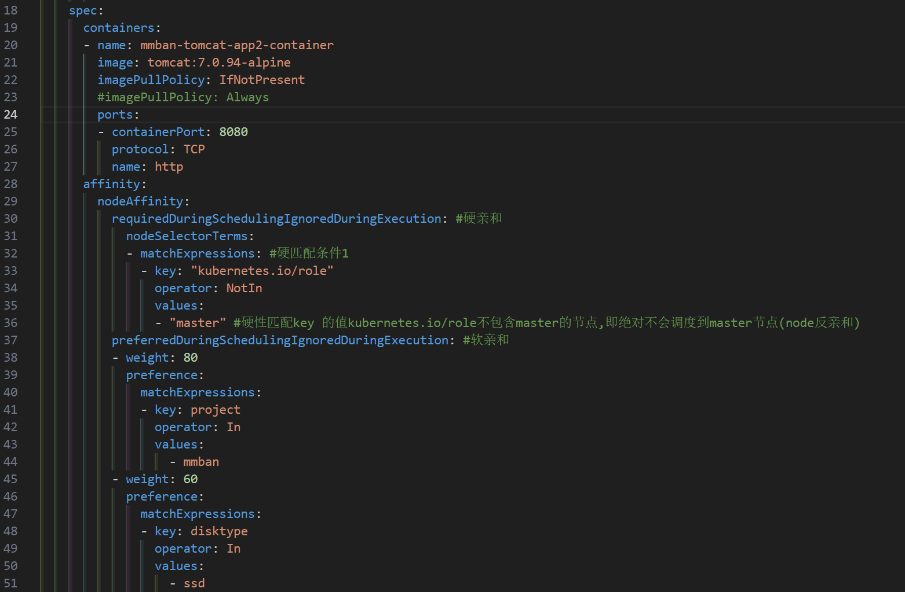

# node Affinity与antiaffinity

## 1.nodeSelector

1. NodeSelector 是 Kubernetes 中一种用于调度 Pod 到特定节点的机制。通过在 Pod 的配置中定义 nodeSelector 字段，为Pod指定一组键值对标签。这些标签将与集群中的节点标签进行匹配，以确定 Pod 应该被调度到哪个节点上运行。
2. 基于node标签选择器，将pod调度的指定的目的节点上。
3. 可用于基于服务类型干预Pod调度结果，如对磁盘I/O要求高的pod调度到SSD节点，对内存要求比较高的pod调度的内存较高的节点。也可以用于区分不同项目的pod，如将node添加不同项目的标签，然后区分调度。

>:mag:https://kubernetes.io/zh/docs/concepts/scheduling-eviction/assign-pod-node/

~~~yaml
## 查看节点标签
root@A-YYYPT-K45-M01 /root # kubectl get node a-yyypt-k45-w03 --show-labels
root@A-YYYPT-K45-M01 /root # kubectl  label  node a-yyypt-k45-w03 --list
beta.kubernetes.io/os=linux
kubernetes.io/arch=amd64
kubernetes.io/hostname=a-yyypt-k45-w03
kubernetes.io/os=linux
beta.kubernetes.io/arch=amd64

## 为节点打标签
## 将pod调度到目的node，yaml文件中指定的key与value必须精确匹配

root@A-YYYPT-K45-M01 /root # kubectl label node a-yyypt-k45-w03  disktype="ssd"           
node/a-yyypt-k45-w03 labeled
root@A-YYYPT-K45-M01 /root # kubectl  label  node a-yyypt-k45-w03 --list       
beta.kubernetes.io/os=linux
disktype=ssd
kubernetes.io/arch=amd64
kubernetes.io/hostname=a-yyypt-k45-w03
kubernetes.io/os=linux
beta.kubernetes.io/arch=amd64
~~~

>此 Pod 配置文件描述了一个拥有节点选择器 `disktype: ssd` 的 Pod。这表明该 Pod 将被调度到有 disktype=ssd 标签的节点。

~~~yaml
apiVersion: v1
kind: Pod
metadata:
  name: nginx
  labels:
    env: test
spec:
  containers:
  - name: nginx
    image: nginx
    imagePullPolicy: IfNotPresent
  nodeSelector:
    disktype: ssd
~~~

## 2.nodeName

1. nodename是一个用于指定 Pod 应该调度到哪个节点的字段。它是 Kubernetes Pod 配置中的一个属性，用于直接控制 Pod 的度。
2. nodename字段允许用户指定一个特定的节点名称，Pod 将被调度到这个节点上。这个字段绕过了 Kubernetes 的调度器，将 Pod 直接绑定到指定的节点。

~~~yaml
apiVersion: v1
kind: Pod
metadata:
  name: example-pod
spec:
  nodeName: a-yyypt-k45-w03
  containers:
  - name: example-container
    image: nginx
~~~

## 3.node affinity(亲和)

1. Affinity主要分为三类：
   - `nodeAffinity(node亲和性）`: 以node为目标，解决pod可以调度到哪些node的问题；
   - `podAffinity(pod亲和性) `: 以pod为目标，解决pod可以和哪些已存在的pod部署在同一个拓扑域中的问题；
   - `podAntiAffinity(pod反亲和性) `: 以pod为目标，解决pod不能和哪些已存在pod部署在同一个拓扑域中的问题
2. affinity是Kubernetes 1.2版本后引入的新特性，类似于nodeSelector，允许使用者指定一些Pod在Node间调度的约束，目前支持两种形式：
   - `requiredDuringSchedulingIgnoredDuringExecution`：必须满足pod调度匹配条件，如果不满足则不进行调度，相当于硬限制。
   - `preferredDuringSchedulingIgnoredDuringExecution`：倾向满足pod调度匹配条件，不满足的情况下会调度的不符合条件的Node上，相当于软限制。多个优先级规则还可以设置权重值，以定义执行的先后顺序。

>1. 标签选择器不仅仅支持and，还支持In、NotIn、Exists、DoesNotExist、Gt、Lt
>   - In：标签的值存在匹配列表中(匹配成功就调度到目的node，实现node亲和)
>   - NotIn：标签的值不存在指定的匹配列表中(不会调度到目的node，实现反亲和)
>   - Exists：指定的标签存在
>   - Gt：标签的值大于某个值(字符串)
>   - Lt：标签的值小于某个值(字符串)
>2. 可以设置软匹配和硬匹配，在软匹配下，如果调度器无法匹配节点，仍然将pod调度到其它不符合条件的节点
>3. 可以对pod定义亲和策略，比如允许哪些pod可以或者不可以被调度至同一台node。

>:bell:`NodeAffinity`的可配置项：

~~~yaml
pod.spec.affinity.nodeAffinity
  requiredDuringSchedulingIgnoredDuringExecution  #Node节点必须满足指定的所有规则才可以，相当于硬限制
    nodeSelectorTerms  #节点选择列表
      matchFields   #按节点字段列出的节点选择器要求列表
      matchExpressions   #按节点标签列出的节点选择器要求列表(推荐)
        key    #键
        values #值
        operat or #关系符 支持Exists, DoesNotExist, In, NotIn, Gt, Lt
  preferredDuringSchedulingIgnoredDuringExecution #优先调度到满足指定的规则的Node，相当于软限制 (倾向)
    preference   #一个节点选择器项，与相应的权重相关联
      matchFields   #按节点字段列出的节点选择器要求列表
      matchExpressions  # 按节点标签列出的节点选择器要求列表(推荐)
        key    #键
        values #值
        operator #关系符 支持In, NotIn, Exists, DoesNotExist, Gt, Lt
  weight #倾向权重，在范围1-100。
~~~

>:bell:注意
>
>1. 如果定义一个nodeSelectorTerms(条件)中通过一个matchExpressions基于列表指定了多个operator条件，则只要满足其中一个条件，就会被调度到相应的节点上，即or的关系，即如果nodeSelectorTerms下面有多个条件的话，只要满足任何一个条件就可以了
>2. 如果定义一个nodeSelectorTerms中都通过一个matchExpressions(匹配表达式)指定key匹配多个条件，则所有的目的条件都必须满足才会调度到对应的节点，即and的关系，即果matchExpressions有多个选项的话，则必须同时满足所有这些条件才能正常调度

### 3.1.硬亲和

- 案例一：

- 案例二：

### 3.2.软亲和

- 软亲和条件1：值越大优先级越高，越优先匹配调度
- 软亲和条件2：在条件1不满足时匹配条件2

### 3.3.硬亲和与软亲和结合使用

1. 基于硬亲和和软亲和实现pod调度：
   - 绝对不会调度在哪些node
   - 倾向于调度到哪些node

## 4.node-antiaffinity(反亲和)

1. 确保 Pod 避免调度到具有特定标签的节点上。使用节点反亲和性可以指定 Pod 不应该被调度到带有某些标签的节点上。
2. 在 matchExpressions 中，使用 operator: NotIn 来定义反亲和规则。

