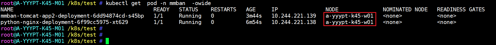
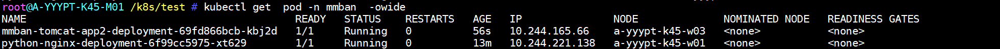

# pod Affinity与pod antiaffinity

## 1.Pod Affinity与anti-affinity简介

1. Pod亲和性与反亲和性可以基于已经在node节点上运行的Pod的标签来约束新创建的Pod可以调度到的目的节点，注意不是基于node上的标签而是使用的已经运行在node上的pod标签匹配。
2. 其规则的格式为如果 node节点 A已经运行了一个或多个满足调度新创建的Pod B的规则，那么新的Pod B在亲和的条件下会调度到A节点之上，而在反亲和性的情况下则不会调度到A节点至上。
3. 其中规则表示一个具有可选的关联命名空间列表的LabelSelector，只所以Pod亲和与反亲和需可以通过LabelSelector选择namespace，是因为Pod是命名空间限定的而node不属于任何nemespace所以node的亲和与反亲和不需要namespace，因此作用于Pod标签的标签选择算符必须指定选择算符应用在哪个命名空间。
4. 从概念上讲，node节点是一个拓扑域(具有拓扑结构的域)，比如k8s集群中的单台node节点、一个机架、云供应商可用区、云供应商地理区域等，可以使用topologyKey来定义亲和或者反亲和的颗粒度是node级别还是可用区级别，以便kubernetes调度系统用来识别并选择正确的目的拓扑域。
5. Pod 亲和性与反亲和性的合法操作符(operator)有 In、NotIn、Exists、DoesNotExist。
6. topologyKey不允许为空(Empty topologyKey is not allowed.)。
7. 对于requiredDuringSchedulingIgnoredDuringExecution要求的Pod反亲和性，准入控制器LimitPodHardAntiAffinityTopology被引入以确保topologyKey只能是 kubernetes.io/hostname，如果希望 topologyKey 也可用于其他定制拓扑逻辑，可以更改准入控制器或者禁用。
8. 除上述情况外，topologyKey 可以是任何合法的标签键。

## 2.Pod Affinity(亲和)

### 2.1.软亲和

1. 基于软亲和实现多pod在一个node
2. 先创建一个nginx服务,后续的服务和nginx运行在同一个node节点

~~~yaml
kind: Deployment
#apiVersion: extensions/v1beta1
apiVersion: apps/v1
metadata:
  labels:
    app: python-nginx-deployment-label
  name: python-nginx-deployment
  namespace: mmban
spec:
  replicas: 1
  selector:
    matchLabels:
      app: python-nginx-selector
  template:
    metadata:
      labels:
        app: python-nginx-selector
        project: python
    spec:
      containers:
      - name: python-nginx-container
        image: nginx:1.20.2-alpine
        #command: ["/apps/tomcat/bin/run_tomcat.sh"]
        #imagePullPolicy: IfNotPresent
        imagePullPolicy: Always
        ports:
        - containerPort: 80
          protocol: TCP
          name: http
        - containerPort: 443
          protocol: TCP
          name: https
        env:
        - name: "password"
          value: "123456"
        - name: "age"
          value: "18"
#        resources:
#          limits:
#            cpu: 2
#            memory: 2Gi
#          requests:
#            cpu: 500m
#            memory: 1Gi

---
kind: Service
apiVersion: v1
metadata:
  labels:
    app: python-nginx-service-label
  name: python-nginx-service
  namespace: mmban
spec:
  type: NodePort
  ports:
  - name: http
    port: 80
    protocol: TCP
    targetPort: 80
    nodePort: 30014
  - name: https
    port: 443
    protocol: TCP
    targetPort: 443
    nodePort: 30453
  selector:
    app: python-nginx-selector
    project: python #一个或多个selector，至少能匹配目标pod的一个标签 
~~~

1. 实现软亲和pod调度

~~~yaml
kind: Deployment
#apiVersion: extensions/v1beta1
apiVersion: apps/v1
metadata:
  labels:
    app: mmban-tomcat-app2-deployment-label
  name: mmban-tomcat-app2-deployment
  namespace: mmban
spec:
  replicas: 1
  selector:
    matchLabels:
      app: mmban-tomcat-app2-selector
  template:
    metadata:
      labels:
        app: mmban-tomcat-app2-selector
    spec:
      containers:
      - name: mmban-tomcat-app2-container
        image: tomcat:7.0.94-alpine
        imagePullPolicy: IfNotPresent
        #imagePullPolicy: Always
        ports:
        - containerPort: 8080
          protocol: TCP
          name: http
      affinity:
        podAffinity:
          #requiredDuringSchedulingIgnoredDuringExecution:
          preferredDuringSchedulingIgnoredDuringExecution:
          - weight: 100
            podAffinityTerm:
              labelSelector:
                matchExpressions:
                - key: project 
                  operator: In
                  values:
                    - python
              topologyKey: kubernetes.io/hostname 
              namespaces: 
                - mmban
~~~

1. 验证pod调度结果，在同一个节点。

### 2.2.硬亲和

1. 基于硬亲和实现多个pod调度在一个node
2. 实现硬亲和pod调度

~~~yaml
kind: Deployment
#apiVersion: extensions/v1beta1
apiVersion: apps/v1
metadata:
  labels:
    app: mmban-tomcat-app2-deployment-label
  name: mmban-tomcat-app2-deployment
  namespace: mmban
spec:
  replicas: 3
  selector:
    matchLabels:
      app: mmban-tomcat-app2-selector
  template:
    metadata:
      labels:
        app: mmban-tomcat-app2-selector
    spec:
      containers:
      - name: mmban-tomcat-app2-container
        image: tomcat:7.0.94-alpine
        imagePullPolicy: IfNotPresent
        #imagePullPolicy: Always
        ports:
        - containerPort: 8080
          protocol: TCP
          name: http
      affinity:
        podAffinity:
          requiredDuringSchedulingIgnoredDuringExecution:
          - labelSelector:
              matchExpressions:
              - key: project
                operator: In
                values:
                  - python
            topologyKey: "kubernetes.io/hostname"
            namespaces:
              - mmban
~~~

1. 验证调度结果，都在同一个节点上。

## 3.Pod Anti-affinity(反亲和)

### 3.1.硬反亲和

1. 基于硬反亲和实现多个pod调度不在一个node
2. 实现硬反亲和pod调度

~~~yaml
kind: Deployment
#apiVersion: extensions/v1beta1
apiVersion: apps/v1
metadata:
  labels:
    app: mmban-tomcat-app2-deployment-label
  name: mmban-tomcat-app2-deployment
  namespace: mmban
spec:
  replicas: 1
  selector:
    matchLabels:
      app: mmban-tomcat-app2-selector
  template:
    metadata:
      labels:
        app: mmban-tomcat-app2-selector
    spec:
      containers:
      - name: mmban-tomcat-app2-container
        image: tomcat:7.0.94-alpine
        imagePullPolicy: IfNotPresent
        #imagePullPolicy: Always
        ports:
        - containerPort: 8080
          protocol: TCP
          name: http
      affinity:
        podAntiAffinity:
          requiredDuringSchedulingIgnoredDuringExecution:
          - labelSelector:
              matchExpressions:
              - key: project
                operator: In
                values:
                  - python
            topologyKey: "kubernetes.io/hostname"
            namespaces:
              - mmban
~~~

### 3.2.软反亲和

1. 基于软亲和实现多个pod调度不在一个node

~~~~yaml
kind: Deployment
#apiVersion: extensions/v1beta1
apiVersion: apps/v1
metadata:
  labels:
    app: mmban-tomcat-app2-deployment-label
  name: mmban-tomcat-app2-deployment
  namespace: mmban
spec:
  replicas: 1
  selector:
    matchLabels:
      app: mmban-tomcat-app2-selector
  template:
    metadata:
      labels:
        app: mmban-tomcat-app2-selector
    spec:
      containers:
      - name: mmban-tomcat-app2-container
        image: tomcat:7.0.94-alpine
        imagePullPolicy: IfNotPresent
        #imagePullPolicy: Always
        ports:
        - containerPort: 8080
          protocol: TCP
          name: http
      affinity:
        podAntiAffinity:
          preferredDuringSchedulingIgnoredDuringExecution:
          - weight: 100
            podAffinityTerm:
              labelSelector:
                matchExpressions:
                - key: project 
                  operator: In
                  values:
                    - python
              topologyKey: kubernetes.io/hostname 
              namespaces: 
                - mmban
~~~~

| 特性     | Pod 亲和性                                                   | Pod 反亲和性                                                 |
| -------- | ------------------------------------------------------------ | ------------------------------------------------------------ |
| 目的     | 将 Pod 调度到有特定标签的其他 Pod 所在的节点上               | 避免将 Pod 调度到与特定标签的其他 Pod 同一节点上             |
| 配置字段 | `podAffinity`                                                | `podAntiAffinity`                                            |
| 匹配条件 | `labelSelector`（标签选择器），`topologyKey`（拓扑键）       | `labelSelector`（标签选择器），`topologyKey`（拓扑键）       |
| 调度策略 | 可以是必需的（`requiredDuringSchedulingIgnoredDuringExecution`）或优先的（`preferredDuringSchedulingIgnoredDuringExecution`） | 可以是必需的（`requiredDuringSchedulingIgnoredDuringExecution`）或优先的（`preferredDuringSchedulingIgnoredDuringExecution`） |
| 使用场景 | 确保相关 Pod 一起运行，例如应用服务与其缓存部署在一起        | 避免应用部署过于集中，例如避免多个副本的 Pod 在同一节点上    |

