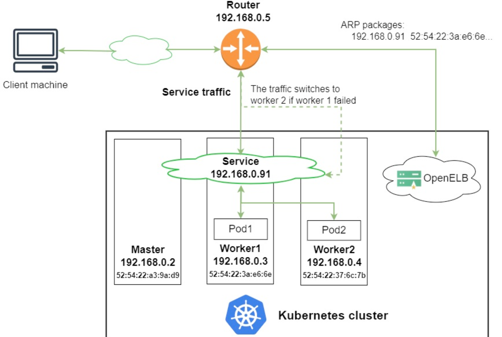
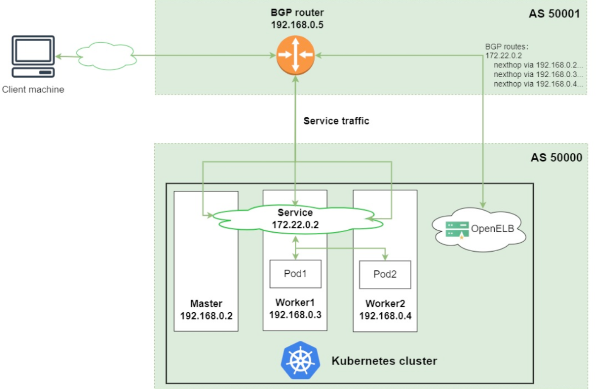

# OpenELB部署及应用

## 1. OpenELB介绍

OpenELB 是一个开源的云原生负载均衡器实现，可以在基于裸金属服务器、边缘以及虚拟化的 Kubernetes 环境中使用 LoadBalancer 类型的 Service 对外暴露服务。OpenELB 项目最初由 KubeSphere 社区发起，目前已作为 CNCF 沙箱项目加入 CNCF 基金会，由 OpenELB 开源社区维护与支持。

与 MetalLB 类似，OpenELB 也拥有两种主要工作模式：Layer2 模式和 BGP 模式。OpenELB 的 BGP 模式目前暂不支持 IPv6。
无论是 Layer2 模式还是 BGP 模式，核心思路都是通过某种方式将特定 VIP 的流量引到 k8s 集群中，然后再通过 kube-proxy 将流量转发到后面的特定服务。

### 1.1. Layer2 模式

> Layer2 模式需要我们的 k8s 集群基础环境支持发送 anonymous ARP/NDP packets。因为 OpenELB 是针对裸金属服务器设计的，因此如果是在云环境中部署，需要注意是否满足条件。

- 图中有一个类型为 LoadBalancer 的 Service，其 VIP 为 192.168.0.91（**和 k8s 的节点相同网段**），后端有两个 pod（分别为 pod1 和 pod2）
- 安装在 Kubernetes 集群中的 OpenELB 随机选择一个节点（图中为 worker 1）来处理 Service  请求。当局域网中出现 arp request 数据包来查询 192.168.0.91 的 mac 地址的时候，OpenELB 会进行回应（使用 worker 1 的 MAC 地址），此时路由器（也可能是交换机）将 Service 的 VIP 192.168.0.91 和 worker 1 的 MAC  地址绑定，之后所有请求到 192.168.0.91 的数据包都会被转发到 worker1 上
- Service 流量到达 worker 1 后， worker 1 上的 kube-proxy 将流量转发到后端的两个 pod 进行负载均衡，这些 pod 不一定在 work1 上

主要的工作流程就如同上面描述的一般，但是还有几个需要额外注意的点：

- 如果 worker 1 出现故障，OpenELB 会重新向路由器发送 APR/NDP 数据包，将 Service IP 地址映射到 worker 2 的 MAC 地址，Service 流量切换到 worker 2
- 主备切换过程并不是瞬间完成的，中间会产生一定时间的服务中断（具体多久官方也没说，实际上应该是却决于检测到节点宕机的时间加上重新选主的时间）
- 如果集群中已经部署了多个 openelb-manager 副本，OpenELB 使用 Kubernetes 的领导者选举特性算法来进行选主，从而确保只有一个副本响应 ARP/NDP 请求

### 1.2. BGP 模式

>OpenELB 的 BGP 模式使用的是gobgp实现的 BGP 协议，通过使用 BGP 协议和路由器建立 BGP 连接并实现 ECMP 负载均衡，从而实现高可用的 LoadBalancer。

- 图中有一个类型为 LoadBalancer 的 Service，其 VIP 为 172.22.0.2（**和 k8s 的节点不同网段**），后端有两个 pod（分别为 pod1 和 pod2）
- 安装在 Kubernetes 集群中的 OpenELB 与 BGP 路由器建立 BGP 连接，并将去往 172.22.0.2  的路由发布到 BGP 路由器，在配置得当的情况下，路由器上面的路由表可以看到 172.22.0.2  这个 VIP 的下一条有多个节点（均为 k8s 的宿主机节点）
- 当外部客户端机器尝试访问 Service 时，BGP 路由器根据从 OpenELB 获取的路由，在 master、worker 1 和  worker 2 节点之间进行流量负载均衡。Service 流量到达一个节点后，该节点上的 kube-proxy  将流量转发到后端的两个 pod 进行负载均衡，这些 pod 不一定在该节点上

### 1.3. 注意事项

部署 Layer2 模式需要把 k8s 集群中的 ipvs 配置打开strictARP，开启之后 k8s 集群中的 `kube-proxy` 会停止响应 `kube-ipvs0` 网卡之外的其他网卡的 arp 请求，而由 MetalLB 接手处理。

`strict ARP` 开启之后相当于把 将 `arp_ignore` 设置为 1 并将 `arp_announce` 设置为 2 启用严格的 ARP，这个原理和 LVS 中的 DR 模式对 RS 的配置一样。

## 2. OpenELB安装

### 2.1. Install OpenELB Using kubectl

1. 通过SSH登录到Kubernetes集群，并运行以下命令:

~~~shell
root@A-YYYPT-K99-M01 /k8s/app/openelb:~ # tree
.
├── layer2-deployment.yaml
├── layer2-eip.yaml
├── layer2-svc.yaml
└── openelb.yaml

0 directories, 4 files
~~~

~~~shell
root@A-YYYPT-K99-M01 /root:~ # wget https://raw.githubusercontent.com/openelb/openelb/release-0.6/deploy/openelb.yaml
root@A-YYYPT-K99-M01 /root:~ # kubectl apply -f openelb.yaml
~~~

2. 运行以下命令检查openelb-controller和openelb-speaker的状态是否就绪:1/1和状态:正在运行。如果是，则OpenELB已经安装成功。

~~~shell
root@A-YYYPT-K99-M01 /root:~ # kubectl get po -n openelb-system
NAME                                  READY   STATUS      RESTARTS        AGE
openelb-admission-create--1-pwmj6     0/1     Completed   0               29d
openelb-admission-patch--1-8lnrn      0/1     Completed   2               29d
openelb-controller-66d4648c67-7jq4p   1/1     Running     63 (134m ago)   29d
openelb-speaker-62hvl                 1/1     Running     3 (19h ago)     22d
openelb-speaker-bfrvc                 1/1     Running     3 (19h ago)     22d
openelb-speaker-fs8zx                 1/1     Running     3 (19h ago)     22d
openelb-speaker-ljqxc                 1/1     Running     3 (19h ago)     22d
~~~

### 2.2. OpenELB安装及配置

>Use OpenELB in Layer 2 Mode

1. 步骤 1：确保已启用 Layer2 模式

可以通过命令行参数启用或禁用 Layer2 模式。使用 Layer2 模式时，请确保已正确启用 Layer2 扬声器。
运行以下命令，编辑 openelb-speaker DaemonSet：

~~~shell
root@A-YYYPT-K99-M01 /root:~ # kubectl edit ds -n openelb-system openelb-speaker
########### 设置enable-layer2为true并保存更改。openelb-speaker 将自动重启。
   containers:
     - command:
         - openelb-speaker
       args:
         - --api-hosts=:50051
         - --enable-layer2=true
         ... ...
~~~

2. 步骤 2：为 kube-proxy 启用 strictARP

在二层模式下，需要为 kube-proxy 启用 strictARP，以便 Kubernetes 集群中的所有 NIC 停止回答来自其他 NIC 的 ARP 请求，而由 OpenELB 来处理 ARP 请求。

~~~shell
root@A-YYYPT-K99-M01 /root:~ # kubectl edit configmap kube-proxy -n kube-system
########### 在 kube-proxy ConfigMap YAML 配置中，设置data.config.conf.ipvs.strictARP为true。
ipvs:
  strictARP: true
  
########### 运行以下命令重新启动 kube-proxy：
root@A-YYYPT-K99-M01 /root:~ # kubectl rollout restart daemonset kube-proxy -n kube-system
~~~

3. 步骤3：创建Eip对象

Eip 对象作为 OpenELB 的 IP 地址池。

~~~shell
 root@A-YYYPT-K99-M01 /k8s/app/openelb:~ # vim layer2-eip.yaml
apiVersion: network.kubesphere.io/v1alpha2
kind: Eip
metadata:
    name: eip-pool
    annotations:
      eip.openelb.kubesphere.io/is-default-eip: "true"
      # 指定当前Eip作为向LoadBalancer Server分配地址时使用默认的eip对象；
spec:
    address: 192.168.1.240-192.168.1.250
    # 地址范围，也可以使用单个IP，或者带有掩码长度的网络地址；
    protocol: layer2
    # 要使用的OpenELB模式，支持bgp、layer2和vip三种，默认为bgp；
    interface: ens33
    # OpenELB侦听ARP或NDP请求时使用的网络接口名称，仅layer2模式下有效；
    disable: false
    
    
 root@A-YYYPT-K99-M01 /k8s/app/openelb:~ # kubectl apply -f layer2-eip.yaml
 root@A-YYYPT-K99-M01 /k8s/app/openelb:~ # kubectl  get eip -n openelb-system 
NAME       CIDR                          USAGE   TOTAL
eip-pool   192.168.1.240-192.168.1.250   2       11
~~~

4. 步骤 4：创建部署

创建Deployment和LoadBalancer Service，测试地址池是否已经能正常向Service分配LoadBalancer IP。

~~~shell
root@A-YYYPT-K99-M01 /k8s/app/openelb:~ # cat > layer2-deployment.yaml << EOF
apiVersion: apps/v1
kind: Deployment
metadata:
  name: layer2-openelb
spec:
  replicas: 2
  selector:
    matchLabels:
      app: layer2-openelb
  template:
    metadata:
      labels:
        app: layer2-openelb
    spec:
      containers:
        - image: luksa/kubia
          name: kubia
          ports:
            - containerPort: 8080
EOF
#########################################

root@A-YYYPT-K99-M01 /k8s/app/openelb:~ # cat > layer2-svc.yaml << EOF
kind: Service
apiVersion: v1
metadata:
  name: layer2-svc
  annotations:
    lb.kubesphere.io/v1alpha1: openelb
    # For versions below 0.6.0, you also need to specify the protocol
    protocol.openelb.kubesphere.io/v1alpha1: layer2
    eip.openelb.kubesphere.io/v1alpha2: eip-pool
spec:
  selector:
    app: layer2-openelb
  type: LoadBalancer
  ports:
    - name: http
      port: 80
      targetPort: 8080
  externalTrafficPolicy: Cluster
EOF
#########################################

root@A-YYYPT-K99-M01 /k8s/app/openelb:~ # root@A-YYYPT-K99-M01 /k8s/app/openelb:~ # kubectl get svc
NAME         TYPE           CLUSTER-IP       EXTERNAL-IP     PORT(S)        AGE
kubernetes   ClusterIP      10.200.0.1       <none>          443/TCP        39d
layer2-svc   LoadBalancer   10.200.180.35    192.168.1.242   80:30538/TCP   3m16s
~~~

5. 验证

>在客户端计算机上，运行以下命令来 ping 服务 IP 地址并检查 IP 

~~~shell
root@A-YYYPT-K99-M01 /k8s/app/openelb:~ # ping 192.168.1.242 -c 5
PING 192.168.1.242 (192.168.1.242) 56(84) bytes of data.
64 bytes from 192.168.1.242: icmp_seq=1 ttl=64 time=0.070 ms
64 bytes from 192.168.1.242: icmp_seq=2 ttl=64 time=0.423 ms
64 bytes from 192.168.1.242: icmp_seq=3 ttl=64 time=0.057 ms
64 bytes from 192.168.1.242: icmp_seq=4 ttl=64 time=0.071 ms
64 bytes from 192.168.1.242: icmp_seq=5 ttl=64 time=0.066 ms

--- 192.168.1.242 ping statistics ---
5 packets transmitted, 5 received, 0% packet loss, time 3996ms
rtt min/avg/max/mdev = 0.057/0.137/0.423/0.142 ms
#########################################

root@A-YYYPT-K99-M01 /k8s/app/openelb:~ # curl 192.168.1.242
You've hit layer2-openelb-7b4fdf6f85-tq7bp
root@A-YYYPT-K99-M01 /k8s/app/openelb:~ # curl 192.168.1.242
You've hit layer2-openelb-7b4fdf6f85-dgmdl
root@A-YYYPT-K99-M01 /k8s/app/openelb:~ # curl 192.168.1.242
You've hit layer2-openelb-7b4fdf6f85-tq7bp
~~~

